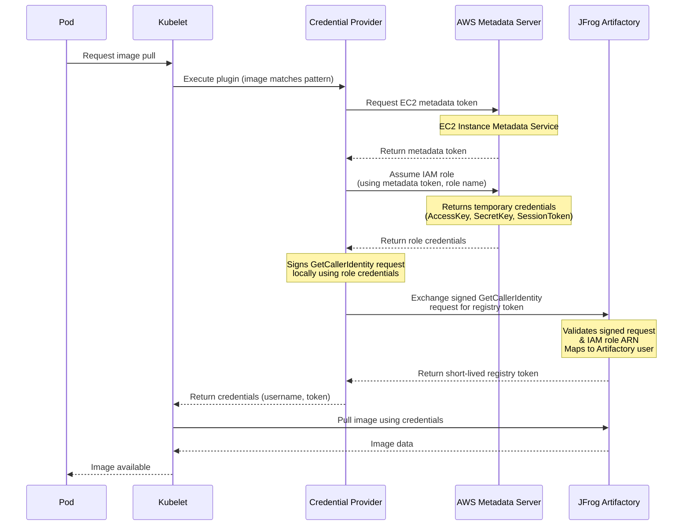
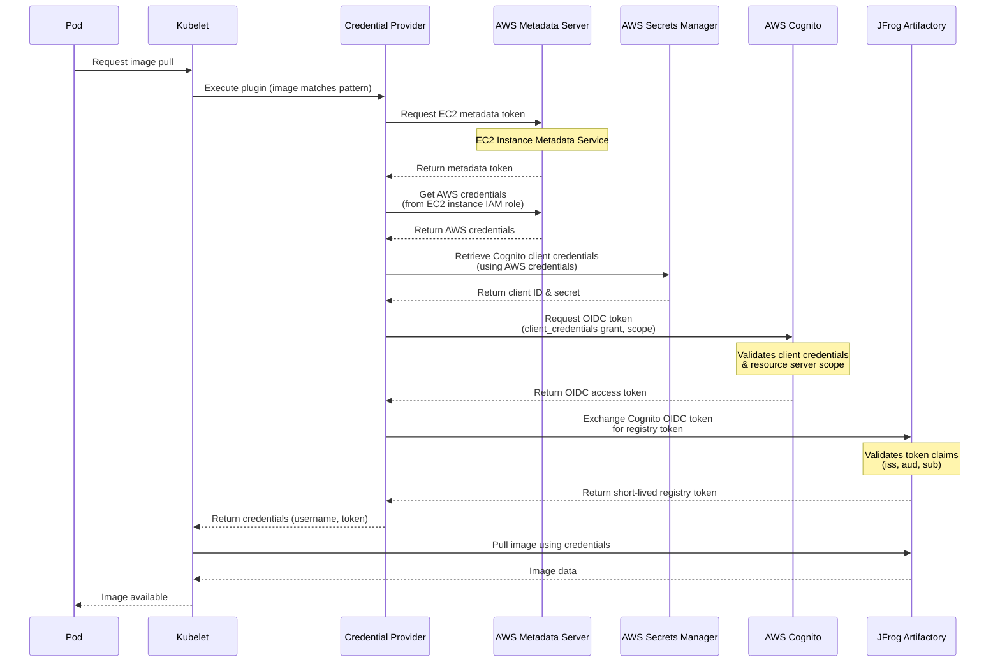

# ☁️ AWS EKS Setup Guide

This guide walks you through setting up the JFrog Kubelet Credential Provider on Amazon Elastic Kubernetes Service (EKS) from scratch.

## 📋 Overview

The JFrog Credentials Provider uses AWS IAM roles or AWS Cognito OIDC to authenticate with JFrog Artifactory via OpenID Connect (OIDC). This eliminates the need for manual image pull secret management by dynamically retrieving credentials when pulling container images.

### 🔄 How It Works

The credential provider supports two authentication methods, each with its own flow:

#### 🆔 IAM Role Assumption Flow



**Key Components (IAM Role Assumption):**
- **IAM Role**: Attached to EKS worker nodes or service accounts, provides AWS credentials
- **AWS STS**: Security Token Service issues temporary credentials
- **Artifactory Exchange**: Artifactory validates the STS identity token and issues a registry token

#### 🔑 Cognito OIDC Flow



**Key Components (Cognito OIDC):**
- **AWS Secrets Manager**: Securely stores Cognito client credentials
- **AWS Cognito**: Issues OIDC access tokens via client_credentials flow
- **Resource Server**: Defines scopes for OIDC token access
- **OIDC Exchange**: Artifactory validates the Cognito token and issues a registry token

For more information about the credential provider architecture, see the [main README](./README.md).

---

## ✅ Prerequisites

Before you begin, ensure you have the following:

- **AWS CLI** installed and authenticated (`aws configure`)
- **An existing EKS cluster** (or permissions to create one)
- **Access to JFrog Artifactory** with admin permissions
- **kubectl** configured to access your EKS cluster
- **Helm 3.x** (if using Helm deployment)

### 🔍 Verify Prerequisites

Run the following commands to verify your setup:

```bash
# Check AWS CLI
aws --version

# Check kubectl access
kubectl get nodes

# Check Helm (if using)
helm version

# Verify AWS credentials
aws sts get-caller-identity
```

---

## 🚀 Setup Process

The setup process consists of four main steps:

1. **AWS IAM Configuration** - Create and configure IAM roles or Cognito OIDC setup
2. **JFrog Artifactory Configuration** - Configure Artifactory to accept AWS credentials/OIDC tokens
3. **Deploy Credentials Provider** - Deploy the credential provider using Helm
4. **Verification** - Verify the credential provider is working correctly

---

## Step 1: 🔐 AWS IAM Configuration

The JFrog Kubelet Credential Provider supports two authentication methods for AWS EKS. You must choose one:

- **IAM Role Assumption** - Uses EC2 instance IAM roles or service account tokens for authentication
- **Cognito OIDC** - Uses OIDC tokens from AWS Cognito for authentication

> **⚠️ Important**: You must select either **IAM Role Assumption** OR **Cognito OIDC** as your authentication method. They cannot be used simultaneously in the same deployment.

---

### Option A: 🆔 IAM Role Assumption

This method uses the IAM role attached to your EKS worker nodes or service accounts. It supports two sub-methods:

1. **EC2 Instance Metadata** - Uses the EC2 instance metadata service (simpler, works for all pods on the node)
2. **Projected Service Account Tokens** - Uses IRSA (IAM Roles for Service Accounts) with KEP 4412 token projection (more secure, per-service-account)

#### Sub-Option A1: EC2 Instance Metadata (Basic Assume Role)

This method uses the EC2 instance metadata service to assume an IAM role and exchange the signed AWS request for an Artifactory token.

**Flow Overview:**

1. The credential provider requests an EC2 metadata token from AWS Metadata Server

2. The provider uses the metadata token to assume the IAM role attached to the EKS worker node, obtaining temporary AWS credentials

3. The provider uses the temporary credentials to sign an AWS STS GetCallerIdentity request locally

4. The provider exchanges the signed request with Artifactory, which validates the signature and IAM role ARN, then returns a short-lived registry access token

5. The kubelet uses the registry token to authenticate and pull the container image

##### Create IAM Role

Create an IAM role that will be used by the credential provider. This role should be attached to your EKS worker nodes.

```bash
# Set variables
ROLE_NAME="jfrog-credentials-provider-role"
POLICY_NAME="jfrog-credentials-provider-policy"

# Create trust policy for EC2 instances
cat > trust-policy.json <<EOF
{
  "Version": "2012-10-17",
  "Statement": [
    {
      "Effect": "Allow",
      "Principal": {
        "Service": "ec2.amazonaws.com"
      },
      "Action": "sts:AssumeRole"
    }
  ]
}
EOF

# Create the IAM role
ROLE_ARN=$(aws iam create-role \
  --role-name "$ROLE_NAME" \
  --assume-role-policy-document file://trust-policy.json \
  --query 'Role.Arn' \
  --output text)

echo "Role ARN: $ROLE_ARN"
```

> **💾 Important:** Save the `ROLE_ARN` - this is your `aws_role_name` (role ARN).

##### Attach Role to EKS Nodes

Attach the IAM role to your EKS node group:

```bash
# Get your node group name
NODE_GROUP_NAME="your-node-group-name"
CLUSTER_NAME="your-eks-cluster"

# Update the node group to use the new role
aws eks update-nodegroup-config \
  --cluster-name "$CLUSTER_NAME" \
  --nodegroup-name "$NODE_GROUP_NAME" \
  --instance-types t3.medium \
  --node-role "$ROLE_ARN"
```

**Note**: If you're using a Launch Template, you'll need to update the IAM instance profile in the Launch Template to use this role.

For more information, see the [AWS EKS Node IAM Role documentation](https://docs.aws.amazon.com/eks/latest/userguide/create-node-role.html).

#### Sub-Option A2: Projected Service Account Tokens (IRSA with KEP 4412)

This method uses IRSA (IAM Roles for Service Accounts) with Kubernetes service account token projection (KEP 4412) for more granular, per-service-account authentication. This provides better security isolation as each service account can have its own IAM role.

**Flow Overview:**

1. The credential provider requests a service account token from Kubernetes with the `sts.amazonaws.com` audience

2. The provider uses the service account token to assume the IAM role via AWS STS AssumeRoleWithWebIdentity, obtaining temporary AWS credentials

3. The provider uses the temporary credentials to sign an AWS STS GetCallerIdentity request locally

4. The provider exchanges the signed request with Artifactory, which validates the signature and IAM role ARN, then returns a short-lived registry access token

5. The kubelet uses the registry token to authenticate and pull the container image

##### Step 1: Create IAM Role for Service Accounts

Create an IAM role that can be assumed by service accounts using OIDC:

```bash
# Set variables
CLUSTER_NAME="your-eks-cluster"
REGION="us-east-1"  # Your EKS cluster region
ROLE_NAME="jfrog-credential-provider-irsa-role"
NAMESPACE="jfrog"  # Your namespace
SERVICE_ACCOUNT_NAME="your-service-account-name"  # Optional: if you want to restrict to specific SA

# Get your EKS cluster OIDC issuer URL
OIDC_ISSUER=$(aws eks describe-cluster \
  --name "$CLUSTER_NAME" \
  --region "$REGION" \
  --query "cluster.identity.oidc.issuer" \
  --output text)

echo "OIDC Issuer: $OIDC_ISSUER"

# Extract the OIDC provider ID from the issuer URL
OIDC_PROVIDER_ID=$(echo "$OIDC_ISSUER" | sed -e "s/^https:\/\///")
echo "OIDC Provider ID: $OIDC_PROVIDER_ID"

# Get your AWS account ID
ACCOUNT_ID=$(aws sts get-caller-identity --query Account --output text)
echo "Account ID: $ACCOUNT_ID"

# Create the trust policy JSON file
# Option A: Restrict to a specific service account
cat > trust-policy.json <<EOF
{
  "Version": "2012-10-17",
  "Statement": [
    {
      "Effect": "Allow",
      "Principal": {
        "Federated": "arn:aws:iam::${ACCOUNT_ID}:oidc-provider/${OIDC_PROVIDER_ID}"
      },
      "Action": "sts:AssumeRoleWithWebIdentity",
      "Condition": {
        "StringEquals": {
          "${OIDC_PROVIDER_ID}:sub": "system:serviceaccount:${NAMESPACE}:${SERVICE_ACCOUNT_NAME}",
          "${OIDC_PROVIDER_ID}:aud": "sts.amazonaws.com"
        }
      }
    }
  ]
}
EOF

# Option B: Allow any service account in the namespace (more flexible)
cat > trust-policy.json <<EOF
{
  "Version": "2012-10-17",
  "Statement": [
    {
      "Effect": "Allow",
      "Principal": {
        "Federated": "arn:aws:iam::${ACCOUNT_ID}:oidc-provider/${OIDC_PROVIDER_ID}"
      },
      "Action": "sts:AssumeRoleWithWebIdentity",
      "Condition": {
        "StringLike": {
          "${OIDC_PROVIDER_ID}:sub": "system:serviceaccount:${NAMESPACE}:*"
        },
        "StringEquals": {
          "${OIDC_PROVIDER_ID}:aud": "sts.amazonaws.com"
        }
      }
    }
  ]
}
EOF

# Create the IAM role
ROLE_ARN=$(aws iam create-role \
  --role-name "$ROLE_NAME" \
  --assume-role-policy-document file://trust-policy.json \
  --description "IAM role for JFrog Credential Provider with service account token projection" \
  --query 'Role.Arn' \
  --output text)

echo "Role ARN: $ROLE_ARN"

# Clean up the trust policy file
rm trust-policy.json
```

**Note**: If your EKS cluster doesn't have an OIDC provider, create it first

> **💾 Important:** Save the `ROLE_ARN` - this is your `aws_role_name` (role ARN).

##### Step 2: Annotate Kubernetes Service Account

Annotate your service account with the IAM role ARN:

```bash
kubectl annotate serviceaccount "$SERVICE_ACCOUNT_NAME" \
  -n "$NAMESPACE" \
  eks.amazonaws.com/role-arn="$ROLE_ARN" \
  --overwrite

# Optionally add JFrogExchange annotation (if your code checks for it)
kubectl annotate serviceaccount "$SERVICE_ACCOUNT_NAME" \
  -n "$NAMESPACE" \
  JFrogExchange="true" \
  --overwrite
```

##### Step 3: Enable RBAC for Token Projection

If using projected service account tokens, you need to enable RBAC in your Helm values:

```yaml
rbac:
  create: true  # Required for service account token projection
```

This creates a Role that allows the `system:nodes` group to:
- Get and list service accounts
- Request service account tokens with the `sts.amazonaws.com` audience

For more information about IRSA, see the [AWS EKS IRSA documentation](https://docs.aws.amazon.com/eks/latest/userguide/iam-roles-for-service-accounts.html).

---

### Option B: 🔑 Cognito OIDC

This method uses AWS Cognito for OIDC authentication. It provides a standards-based OIDC flow and is recommended for organizations that want to use OIDC throughout their infrastructure.

**Flow Overview:**

1. The credential provider requests an EC2 metadata token and uses it to obtain AWS credentials from the EC2 instance's IAM role

2. The provider uses the AWS credentials to retrieve Cognito client ID and client secret from AWS Secrets Manager

3. The provider queries AWS Cognito to get the resource server configuration (resource server ID and user pool resource domain)

4. The provider requests an OIDC access token from AWS Cognito using the OAuth2 client credentials grant flow with the resource server scope

5. The provider exchanges the Cognito OIDC token with Artifactory, which validates the token claims and returns a short-lived registry access token

6. The kubelet uses the registry token to authenticate and pull the container image

#### Create Cognito User Pool

```bash
# Set variables
USER_POOL_NAME="jfrog-credentials-provider-pool"
CLIENT_NAME="jfrog-credentials-provider-client"

# Create Cognito User Pool
USER_POOL_ID=$(aws cognito-idp create-user-pool \
  --pool-name "$USER_POOL_NAME" \
  --query 'UserPool.Id' --output text)

echo "User Pool ID: $USER_POOL_ID"

# Create User Pool Client
CLIENT_ID=$(aws cognito-idp create-user-pool-client \
  --user-pool-id "$USER_POOL_ID" \
  --client-name "$CLIENT_NAME" \
  --generate-secret \
  --query 'UserPoolClient.ClientId' --output text)

CLIENT_SECRET=$(aws cognito-idp describe-user-pool-client \
  --user-pool-id "$USER_POOL_ID" \
  --client-id "$CLIENT_ID" \
  --query 'UserPoolClient.ClientSecret' --output text)

echo "Client ID: $CLIENT_ID"
echo "Client Secret: $CLIENT_SECRET"
```

> **💾 Important:** Save these values:
> - `USER_POOL_ID`
> - `CLIENT_ID`
> - `CLIENT_SECRET`

#### Store Cognito Credentials in AWS Secrets Manager

Store the Cognito client credentials securely in AWS Secrets Manager:

```bash
# Set variables
SECRET_NAME="jfrog-cognito-credentials"

# Create secret
aws secretsmanager create-secret \
  --name "$SECRET_NAME" \
  --secret-string "{\"client-id\":\"$CLIENT_ID\",\"client-secret\":\"$CLIENT_SECRET\"}"

echo "Secret Name: $SECRET_NAME"
```

> **💾 Important:** Save the `SECRET_NAME` - you'll need it for the credential provider configuration (as `secret_name` in the values file).

#### Create Cognito Resource Server (Required for OIDC)

The Cognito OIDC method requires a resource server with a scope. Create one if you don't have it:

```bash
# Set variables
RESOURCE_SERVER_NAME="jfrog-resource-server"
RESOURCE_SCOPE="read"

# Create resource server
aws cognito-idp create-resource-server \
  --user-pool-id "$USER_POOL_ID" \
  --identifier "$RESOURCE_SERVER_NAME" \
  --name "$RESOURCE_SERVER_NAME" \
  --scopes '[{"ScopeName":"'"$RESOURCE_SCOPE"'","ScopeDescription":"JFrog Credentials Provider Scope"}]'

echo "Resource Server Name: $RESOURCE_SERVER_NAME"
echo "Resource Scope: $RESOURCE_SCOPE"
```

> **💾 Important:** Save these values - you'll need them for the credential provider configuration:
> - `RESOURCE_SERVER_NAME` (as `aws_cognito_resource_server_name` in values file)
> - `RESOURCE_SCOPE` (as `aws_cognito_user_pool_resource_scope` in values file)
>
> **Note:** The credential provider constructs the full OAuth2 scope automatically as `<resource_server_identifier>/<scope>` (e.g., `jfrog-resource-server/read`). You only need to provide the scope name (e.g., `read`).

#### Update User Pool Client with OAuth Settings

After the resource server is created, update the user pool client to enable the `client_credentials` OAuth flow with the resource server scope:

```bash
aws cognito-idp update-user-pool-client \
  --user-pool-id "$USER_POOL_ID" \
  --client-id "$CLIENT_ID" \
  --allowed-o-auth-flows client_credentials \
  --allowed-o-auth-scopes "$RESOURCE_SERVER_NAME/$RESOURCE_SCOPE" \
  --allowed-o-auth-flows-user-pool-client
```

#### Grant Node Access to Cognito and Secrets Manager

The EKS worker node IAM role needs permissions to read from Secrets Manager and query Cognito. Create a least-privilege policy:

```bash
NODE_ROLE_NAME="your-eks-node-role-name"
ACCOUNT_ID=$(aws sts get-caller-identity --query Account --output text)
POLICY_NAME="jfrog-credential-provider-cognito-policy"

# Create a least-privilege IAM policy
POLICY_ARN=$(aws iam create-policy \
  --policy-name "$POLICY_NAME" \
  --policy-document '{
    "Version": "2012-10-17",
    "Statement": [
      {
        "Sid": "SecretsManagerRead",
        "Effect": "Allow",
        "Action": "secretsmanager:GetSecretValue",
        "Resource": "arn:aws:secretsmanager:*:'"$ACCOUNT_ID"':secret:'"$SECRET_NAME"'-*"
      },
      {
        "Sid": "CognitoRead",
        "Effect": "Allow",
        "Action": [
          "cognito-idp:ListUserPools",
          "cognito-idp:DescribeUserPool",
          "cognito-idp:ListResourceServers"
        ],
        "Resource": "*"
      }
    ]
  }' \
  --query 'Policy.Arn' --output text)

# Attach policy to the EKS node role
aws iam attach-role-policy \
  --role-name "$NODE_ROLE_NAME" \
  --policy-arn "$POLICY_ARN"
```

> **📝 Note:** The policy grants:
> - `secretsmanager:GetSecretValue` — scoped to the specific secret containing Cognito client credentials
> - `cognito-idp:ListUserPools` — used to find the user pool by name
> - `cognito-idp:DescribeUserPool` — used to retrieve the user pool domain (required for the OAuth2 token endpoint)
> - `cognito-idp:ListResourceServers` — used to find the resource server identifier

For more information about AWS Cognito, see the [AWS Cognito documentation](https://docs.aws.amazon.com/cognito/latest/developerguide/what-is-amazon-cognito.html).

---

## Step 2: 🐸 JFrog Artifactory Configuration

Configure JFrog Artifactory to accept credentials or OIDC tokens from AWS. This involves creating an OIDC provider and an identity mapping in Artifactory (for Cognito OIDC method), or mapping IAM roles to users (for assume_role method).

For more information, see the [JFrog Artifactory OIDC Documentation](https://www.jfrog.com/confluence/display/JFROG/Access+Tokens#AccessTokens-OIDCIntegration).

### 🔑 Get Artifactory Admin Token

You'll need an Artifactory admin access token to configure OIDC. If you don't have one, create it in Artifactory under **Administration** → **Identity and Access** → **Access Tokens**.

```bash
# Set your Artifactory details
ARTIFACTORY_URL="your-instance.jfrog.io"
ARTIFACTORY_ADMIN_TOKEN="your-admin-access-token"
ARTIFACTORY_USER="aws-eks-user"  # User that will be mapped to AWS credentials/OIDC tokens
```

### For IAM Role Assumption Method and Projected Token Method

If using IAM Role Assumption, you need to map the IAM role to an Artifactory user. This is done through Artifactory's API.

#### Delete Existing Binding (if any)

```bash
curl -X DELETE "https://$ARTIFACTORY_URL/access/api/v1/aws/iam_role/$ARTIFACTORY_USER" \
  -H "Authorization: Bearer $ARTIFACTORY_ADMIN_TOKEN"
```

#### Create IAM Role Binding

```bash
curl -X PUT "https://$ARTIFACTORY_URL/access/api/v1/aws/iam_role" \
  -H "Content-Type: application/json" \
  -H "Authorization: Bearer $ARTIFACTORY_ADMIN_TOKEN" \
  -d "{
    \"username\": \"$ARTIFACTORY_USER\",
    \"iam_role\": \"$ROLE_ARN\"
  }"
```

#### Verify the Binding

```bash
curl -X GET "https://$ARTIFACTORY_URL/access/api/v1/aws/iam_role/$ARTIFACTORY_USER" \
  -H "Authorization: Bearer $ARTIFACTORY_ADMIN_TOKEN"
```

<details>
<summary><strong>📝 Configuration Notes</strong></summary>

- The IAM role ARN must be mapped to an existing Artifactory user
- Ensure the user has permissions to pull images from your repositories
- The mapping is done through Artifactory's API, not OIDC
- No OIDC provider setup is required in Artifactory for this method
- The credential provider will send a signed AWS STS GetCallerIdentity request to Artifactory's `/access/api/v1/aws/token` endpoint

</details>

For more information about IAM role mapping in Artifactory, see the [JFrog Artifactory documentation](https://www.jfrog.com/confluence/display/JFROG/User+Profile).

### For Cognito OIDC Method

If using Cognito OIDC, you need to create an OIDC provider and identity mapping in Artifactory.

#### ➕ Create OIDC Provider in Artifactory

```bash
OIDC_PROVIDER_NAME="aws-cognito-oidc-provider"  # Choose a name

# Get Cognito issuer URL (replace REGION and USER_POOL_ID)
COGNITO_ISSUER="https://cognito-idp.$REGION.amazonaws.com/$USER_POOL_ID"

curl -X POST "https://$ARTIFACTORY_URL/access/api/v1/oidc" \
  -H "Content-Type: application/json" \
  -H "Authorization: Bearer $ARTIFACTORY_ADMIN_TOKEN" \
  -d "{
    \"name\": \"$OIDC_PROVIDER_NAME\",
    \"issuer_url\": \"$COGNITO_ISSUER\",
    \"description\": \"OIDC provider for AWS Cognito\",
    \"provider_type\": \"Generic OpenID Connect\",
    \"token_issuer\": \"$COGNITO_ISSUER\",
    \"use_default_proxy\": false
  }"
```

For more details, see the [JFrog REST API documentation for creating OIDC configuration](https://jfrog.com/help/r/jfrog-rest-apis/create-oidc-configuration).

#### 🗺️ Create Identity Mapping

The identity mapping tells Artifactory how to map Cognito OIDC tokens to Artifactory users.

> **⚠️ Important:** Ensure `expires_in` is longer than the `defaultCacheDuration` configured in your Helm values. For example, if `defaultCacheDuration` is `5h`, set `expires_in` to at least **18000 seconds (5 hours)** or longer. If the Artifactory token expires before the cache does, image pulls will fail with authentication errors until the cache refreshes.

```bash
curl -X POST "https://$ARTIFACTORY_URL/access/api/v1/oidc/$OIDC_PROVIDER_NAME/identity_mappings" \
  -H "Content-Type: application/json" \
  -H "Authorization: Bearer $ARTIFACTORY_ADMIN_TOKEN" \
  -d "{
    \"name\": \"$OIDC_PROVIDER_NAME\",
    \"description\": \"AWS Cognito OIDC identity mapping\",
    \"claims\": {
      \"iss\": \"$COGNITO_ISSUER\",
      \"client_id\": \"$CLIENT_ID\"
    },
    \"token_spec\": {
      \"username\": \"$ARTIFACTORY_USER\",
      \"scope\": \"applied-permissions/user\",
      \"audience\": \"*@*\",
      \"expires_in\": 18000
    },
    \"priority\": 1
  }"
```

<details>
<summary><strong>📝 Configuration Notes</strong></summary>

- The `claims.iss` must match your Cognito issuer URL
- The `claims.client_id` must match your Cognito client ID (Cognito access tokens use `client_id`, not `aud`)
- The `token_spec.username` must be an existing Artifactory user
- Ensure the user has permissions to pull images from your repositories

</details>

For more information, see the [JFrog Platform Administration documentation on identity mappings](https://jfrog.com/help/r/jfrog-platform-administration-documentation/identity-mappings).

#### ✅ Verify OIDC Provider

```bash
# List OIDC providers
curl -X GET "https://$ARTIFACTORY_URL/access/api/v1/oidc" \
  -H "Authorization: Bearer $ARTIFACTORY_ADMIN_TOKEN" | jq

# Get specific provider details
curl -X GET "https://$ARTIFACTORY_URL/access/api/v1/oidc/$OIDC_PROVIDER_NAME" \
  -H "Authorization: Bearer $ARTIFACTORY_ADMIN_TOKEN" | jq
```

---

## Step 3: 🚀 Deploy Credentials Provider

Deploy the credential provider using Helm. For manual deployment with Kubernetes manifests, refer to the [Kubernetes Kubelet Credential Provider documentation](https://kubernetes.io/docs/tasks/administer-cluster/kubelet-credential-provider/).

### 📝 Prepare Values File

#### For IAM Role Assumption Method (EC2 Instance Metadata)

| Configuration Value | Description | Example |
|---------------------|-------------|---------|
| `aws_role_name` | The IAM role ARN | `arn:aws:iam::123456789012:role/jfrog-credentials-provider-role` |
| `aws_auth_method` | Authentication method | `assume_role` |
| `artifactory_url` | Your JFrog Artifactory URL | `your-instance.jfrog.io` |

Update the values file at `./examples/aws-values.yaml` with your configuration values.

#### For IAM Role Assumption Method (Projected Service Account Tokens)

Update the values file at `./examples/aws-projected-sa-values.yaml` with your configuration values.

#### For Cognito OIDC Method

| Configuration Value | Description | Example |
|---------------------|-------------|---------|
| `aws_auth_method` | Authentication method | `cognito_oidc` |
| `artifactoryUrl` | Your JFrog Artifactory URL | `your-instance.jfrog.io` |
| `aws_cognito_user_pool_secret_name` | AWS Secrets Manager secret name containing client-id and client-secret | `jfrog-cognito-credentials` |
| `aws_cognito_user_pool_name` | Cognito User Pool name | `jfrog-credentials-provider-pool` |
| `aws_cognito_resource_server_name` | Cognito Resource Server name | `jfrog-resource-server` |
| `aws_cognito_user_pool_resource_scope` | Scope name on the resource server | `read` |
| `jfrog_oidc_provider_name` | OIDC provider name configured in Artifactory | `aws-cognito-oidc-provider` |

Update the values file at `./examples/aws-cognito-oidc-values.yaml` with your configuration values.


### 📦 Install with Helm


#### Add JFrog Helm repository

Before installing JFrog helm charts, you need to add the [JFrog helm repository](https://charts.jfrog.io/) to your helm client

```bash
helm repo add jfrog https://charts.jfrog.io
helm repo update
```

And then install using the following command - 

```bash
# Install the credential provider (IAM Role Assumption)
helm upgrade --install secret-provider jfrog/jfrog-credential-provider \
  --namespace jfrog \
  --create-namespace \
  -f ./examples/aws-values.yaml

```

OR

```bash
# Install the credential provider (Projected Service Account Tokens)
helm upgrade --install secret-provider jfrog/jfrog-credential-provider \
  --namespace jfrog \
  --create-namespace \
  -f ./examples/aws-projected-sa-values.yaml

```

OR

```bash
# Install the credential provider (Cognito OIDC)
helm upgrade --install secret-provider jfrog/jfrog-credential-provider \
  --namespace jfrog \
  --create-namespace \
  -f ./examples/aws-cognito-oidc-values.yaml

```

---

## ✅ Verification

After deployment, verify that the credential provider is working correctly.

### 📊 Check DaemonSet Status

```bash
kubectl get daemonset -n jfrog
kubectl get pods -n jfrog
```

All pods should be in `Running` state.

### 🧪 Test Image Pull

Create a test pod that pulls from your Artifactory registry:

```bash
# Get node names (if you deployed in a particular node group)
kubectl get nodes

# Create a test pod
kubectl run test-pull \
  --image=your-instance.jfrog.io/your-repo/test-image:latest \
  --restart=Never \
  --rm -it \
  --overrides='{"spec":{"nodeName":"your-node-name"}}'

# Check if it pulls successfully
kubectl describe pod test-pull
```

---

## 🔧 Troubleshooting

For troubleshooting help, see the [debug documentation](./debug.md).

---

## 📚 Additional Resources

- [AWS IAM Roles Documentation](https://docs.aws.amazon.com/IAM/latest/UserGuide/id_roles.html)
- [AWS Cognito Documentation](https://docs.aws.amazon.com/cognito/latest/developerguide/what-is-amazon-cognito.html)
- [AWS EKS Node IAM Role](https://docs.aws.amazon.com/eks/latest/userguide/create-node-role.html)
- [IRSA (IAM Roles for Service Accounts)](https://docs.aws.amazon.com/eks/latest/userguide/iam-roles-for-service-accounts.html)
- [AWS Secrets Manager](https://docs.aws.amazon.com/secretsmanager/latest/userguide/intro.html)
- [JFrog Artifactory OIDC Documentation](https://www.jfrog.com/confluence/display/JFROG/Access+Tokens#AccessTokens-OIDCIntegration)
- [Kubernetes Kubelet Credential Provider](https://kubernetes.io/docs/tasks/administer-cluster/kubelet-credential-provider/)
- [Main README](./README.md)

