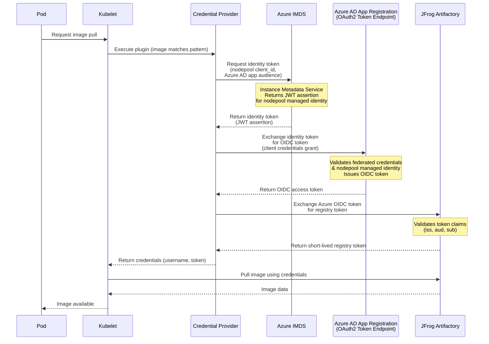

# 🔷 Azure AKS Setup Guide

This guide walks you through setting up the JFrog Kubelet Credential Provider on Azure Kubernetes Service (AKS) from scratch.

## 📋 Overview

The JFrog Credentials Provider uses Azure managed identities to authenticate with JFrog Artifactory via OpenID Connect (OIDC). This eliminates the need for manual image pull secret management by dynamically retrieving credentials when pulling container images.

### 🔄 How It Works




**Key Components:**
- **Azure IMDS**: Instance Metadata Service provides the managed identity token (JWT assertion) for the nodepool's managed identity
- **Azure AD**: Validates the nodepool's managed identity via federated credentials and issues an OIDC token for the Azure AD app
- **Azure AD App Registration**: Azure app registration configured with federated credentials, mapped to Artifactory's OIDC provider
- **Federated Credentials**: Establishes trust between the AKS nodepool's managed identity and the Azure AD app registration
- **OIDC Token Exchange**: Artifactory validates the Azure OIDC token and issues a short-lived registry access token

For more information about the credential provider architecture, see the [main README](./README.md).

---

## ✅ Prerequisites

Before you begin, ensure you have the following:

- **Azure CLI** installed and authenticated (`az login`)
- **An existing AKS cluster** (or permissions to create one)
- **Access to JFrog Artifactory** with admin permissions
- **kubectl** configured to access your AKS cluster
- **Helm 3.x** (if using Helm deployment)

### 🔍 Verify Prerequisites

Run the following commands to verify your setup:

```bash
# Check Azure CLI
az --version

# Check kubectl access
kubectl get nodes

# Check Helm (if using)
helm version
```

---

## 🚀 Setup Process

The setup process consists of four main steps:

1. **Azure AD App Registration** - Create an enterprise application in Azure AD
2. **Federated Identity Credentials** - Configure AKS nodepool access to the Azure App 
3. **JFrog Artifactory OIDC Configuration** - Configure Artifactory to create Azure OIDC mappings
4. **Deploy Credentials Provider** - Deploy the credential provider using Helm

---

## Step 1: 🔐 Azure AD App Registration

The Azure AD App Registration serves as the identity that authenticates with JFrog Artifactory via OIDC.

**Flow Overview:**
1. The credential provider requests an identity token from Azure IMDS using the nodepool's managed identity, targeting the Azure AD app registration audience

2. Azure AD validates the managed identity via federated credentials and returns an identity token (JWT assertion)

3. The provider exchanges the identity token for an OIDC access token from Azure AD using the OAuth2 client credentials grant flow

4. The provider exchanges the Azure OIDC token with Artifactory, which validates it and returns a short-lived registry access token

5. The kubelet uses the registry token to authenticate and pull the container image

For more information about Azure AD applications, see the [Azure AD App Registrations documentation](https://learn.microsoft.com/en-us/azure/active-directory/develop/quickstart-register-app).

### ➕ Create Azure AD Application

```bash
# Set variables
APP_DISPLAY_NAME="jfrog-credentials-provider-aks"
TENANT_ID=$(az account show --query tenantId -o tsv)

# Create the application
APP_CLIENT_ID=$(az ad app create \
  --display-name "$APP_DISPLAY_NAME" \
  --query appId -o tsv)

echo "Application Client ID: $APP_CLIENT_ID"
echo "Tenant ID: $TENANT_ID"
```

> **💾 Important:** Save these values for later use:
> - `APP_CLIENT_ID` (also called `azure_app_client_id`)
> - `TENANT_ID` (also called `azure_tenant_id`)

### 👤 Create Service Principal

```bash
# Create service principal for the application
az ad sp create --id "$APP_CLIENT_ID"
```

### 🔒 Enable Assignment Required (Recommended)

By default, **Assignment Required** is set to **No** on the enterprise application. This means any user or service principal in your tenant can acquire an access token from the app registration. Since the JFrog Credential Provider exchanges this token with Artifactory for image pull credentials, leaving this open is a security concern.

Setting **Assignment Required** to **Yes** ensures that only explicitly assigned principals can obtain tokens from the app.

**Enable via Azure Portal:**

1. Navigate to **Azure Portal** → **Enterprise applications**
2. Search for your application by name
3. Go to **Properties**
4. Set **Assignment required?** to **Yes**
5. Click **Save**

**Enable via Azure CLI:**

```bash
SPN_OBJECT_ID=$(az ad sp list --filter "appId eq '$APP_CLIENT_ID'" --query "[0].id" -o tsv)

az rest --method PATCH \
  --uri "https://graph.microsoft.com/v1.0/servicePrincipals/$SPN_OBJECT_ID" \
  --headers "Content-Type=application/json" \
  --body '{"appRoleAssignmentRequired": true}'
```

After enabling this, the credential provider will fail to obtain tokens because the app's own service principal is not assigned. To fix this, assign the service principal to itself by creating an app role and assigning it:

**1. Create an App Role**

Navigate to **Azure Portal** → **App registrations** → your app → **App roles** → **Create app role**:
- **Display name**: e.g., `Task.Read`
- **Allowed member types**: Applications
- **Value**: `Task.Read`
- **Description**: Role for credential provider access

Or via CLI:

```bash
OBJECT_ID=$(az ad app show --id "$APP_CLIENT_ID" --query "id" -o tsv)

az rest --method PATCH \
  --uri "https://graph.microsoft.com/v1.0/applications/$OBJECT_ID" \
  --headers "Content-Type=application/json" \
  --body '{
    "appRoles": [{
      "allowedMemberTypes": ["Application"],
      "displayName": "Task.Read",
      "id": "'$(uuidgen)'",
      "isEnabled": true,
      "description": "Role for credential provider access",
      "value": "Task.Read"
    }]
  }'
```

**2. Get the SPN Object ID and Role ID**

```bash
SPN_OBJECT_ID=$(az ad sp list --filter "appId eq '$APP_CLIENT_ID'" --query "[0].id" -o tsv)
ROLE_ID=$(az ad sp show --id "$SPN_OBJECT_ID" --query "appRoles[?value=='Task.Read'].id" -o tsv)
```

**3. Assign the Service Principal to itself**

```bash
az rest --method POST \
  --uri "https://graph.microsoft.com/v1.0/servicePrincipals/$SPN_OBJECT_ID/appRoleAssignments" \
  --headers "Content-Type=application/json" \
  --body "{
    \"principalId\": \"$SPN_OBJECT_ID\",
    \"resourceId\": \"$SPN_OBJECT_ID\",
    \"appRoleId\": \"$ROLE_ID\"
  }"
```

After this, the credential provider will continue to work via the federated credentials on the nodepool managed identity, but other apps in your tenant will no longer be able to obtain tokens from this app registration.

### ⚙️ Configure Access Token Version

The credential provider uses `https://login.microsoftonline.com` as the issuer URL (instead of the older `https://sts.windows.net/`). Azure requires you to set `requestedAccessTokenVersion` to `2` for this to work.

```bash
# Get the object ID of the app created above
OBJECT_ID=$(az ad app show --id "$APP_CLIENT_ID" --query "id" -o tsv)

# Update the access token version
az rest --method PATCH \
  --headers "Content-Type=application/json" \
  --uri "https://graph.microsoft.com/v1.0/applications/$OBJECT_ID" \
  --body '{"api":{"requestedAccessTokenVersion": 2}}'
```

**🌐 Alternative: Configure via Azure Portal**

1. Navigate to **Azure Portal** → **Azure Active Directory** → **App registrations**
2. Search for your application by name or client ID
3. Go to **Manifest**
4. Set `"requestedAccessTokenVersion": 2` in the JSON
5. Click **Save**

---

## Step 2: 🔗 Federated Identity Credentials

Federated credentials allow the AKS nodepool's managed identity to exchange tokens with the Azure AD App Registration. This establishes trust between your AKS cluster and Azure AD.

For more information, see the [Azure Managed Identities documentation](https://learn.microsoft.com/en-us/azure/active-directory/managed-identities-azure-resources/).

### 📊 Get AKS Cluster Information

```bash
# Set your cluster details
RESOURCE_GROUP="your-resource-group"
CLUSTER_NAME="your-aks-cluster"

# Get the kubelet identity object ID (this is what we'll use for federated credentials)
KUBELET_IDENTITY_OBJECT_ID=$(az aks show \
  --resource-group "$RESOURCE_GROUP" \
  --name "$CLUSTER_NAME" \
  --query "identityProfile.kubeletidentity.objectId" -o tsv)

KUBELET_IDENTITY_CLIENT_ID=$(az aks show \
  --resource-group "$RESOURCE_GROUP" \
  --name "$CLUSTER_NAME" \
  --query "identityProfile.kubeletidentity.clientId" -o tsv)

echo "Kubelet Identity Object ID: $KUBELET_IDENTITY_OBJECT_ID"
echo "Kubelet Identity Client ID: $KUBELET_IDENTITY_CLIENT_ID"
```

### 📌 Get the User-Assigned Managed Identity (Nodepool Client ID)

The `azure_nodepool_client_id` is the client ID of the user-assigned managed identity that is attached to your AKS nodepool. This is the same identity that you add to the federated credentials of the app registration (in the next step).

The credential provider runs on the node and uses this managed identity to request an identity token from Azure IMDS, which is then exchanged for an OIDC access token from the app registration.

```bash
# Get the node resource group
NODE_RESOURCE_GROUP=$(az aks show \
  --resource-group "$RESOURCE_GROUP" \
  --name "$CLUSTER_NAME" \
  --query "nodeResourceGroup" -o tsv)

# Get nodepool identity name (usually <cluster-name>-agentpool)
NODEPOOL_IDENTITY_NAME=$(az identity list \
  --resource-group "$NODE_RESOURCE_GROUP" \
  --query "[?contains(name, 'agentpool')].name" -o tsv | head -1)

# Get the object ID (needed for the federated credential subject)
NODEPOOL_IDENTITY_OBJECT_ID=$(az identity show \
  --resource-group "$NODE_RESOURCE_GROUP" \
  --name "$NODEPOOL_IDENTITY_NAME" \
  --query "principalId" -o tsv)

# Get the client ID (needed for the credential provider config)
NODEPOOL_CLIENT_ID=$(az identity show \
  --resource-group "$NODE_RESOURCE_GROUP" \
  --name "$NODEPOOL_IDENTITY_NAME" \
  --query "clientId" -o tsv)

echo "Nodepool Identity Object ID: $NODEPOOL_IDENTITY_OBJECT_ID"
echo "Nodepool Client ID: $NODEPOOL_CLIENT_ID"
```

> **💾 Important:** Save `NODEPOOL_CLIENT_ID` - this is your `azure_nodepool_client_id`.
> This identity must also be added as the **subject** in the federated credential of the app registration (see next step).

### ➕ Create Federated Identity Credential

```bash
# Use the kubelet identity object ID (or nodepool if different)
FEDERATED_CREDENTIAL_NAME="aks-nodepool-federated-credential"
AUDIENCE="api://AzureADTokenExchange"
ISSUER="https://login.microsoftonline.com/$TENANT_ID/v2.0"

# Create the federated credential
az ad app federated-credential create \
  --id "$APP_CLIENT_ID" \
  --parameters "{
    \"name\": \"$FEDERATED_CREDENTIAL_NAME\",
    \"issuer\": \"$ISSUER\",
    \"subject\": \"$KUBELET_IDENTITY_OBJECT_ID\",
    \"audiences\": [\"$AUDIENCE\"],
    \"description\": \"Federated credential for AKS nodepool managed identity\"
  }"
```

### ✅ Verify Federated Credential

```bash
# List federated credentials
az ad app federated-credential list --id "$APP_CLIENT_ID"
```

You should see your federated credential with:
- `issuer`: `https://login.microsoftonline.com/<TENANT_ID>/v2.0`
- `subject`: Your kubelet/nodepool identity object ID
- `audiences`: `["api://AzureADTokenExchange"]`

---

## Step 3: 🐸 JFrog Artifactory OIDC Configuration

Configure JFrog Artifactory to accept OIDC tokens from Azure. This involves creating an OIDC provider and an identity mapping in Artifactory.

For more information, see the [JFrog Artifactory OIDC Documentation](https://www.jfrog.com/confluence/display/JFROG/Access+Tokens#AccessTokens-OIDCIntegration).

### 🔑 Get Artifactory Admin Token

You'll need an Artifactory admin access token to configure OIDC. If you don't have one, create it in Artifactory under **Administration** → **Identity and Access** → **Access Tokens**.

```bash
# Set your Artifactory details
ARTIFACTORY_URL="your-instance.jfrog.io"
ARTIFACTORY_ADMIN_TOKEN="your-admin-access-token"
ARTIFACTORY_USER="azure-aks-user"  # User that will be mapped to OIDC tokens
OIDC_PROVIDER_NAME="azure-aks-oidc-provider"  # Choose a name
```

### ➕ Create OIDC Provider in Artifactory

```bash
curl -X POST "https://$ARTIFACTORY_URL/access/api/v1/oidc" \
  -H "Content-Type: application/json" \
  -H "Authorization: Bearer $ARTIFACTORY_ADMIN_TOKEN" \
  -d "{
    \"name\": \"$OIDC_PROVIDER_NAME\",
    \"issuer_url\": \"https://login.microsoftonline.com/$TENANT_ID/v2.0\",
    \"description\": \"OIDC provider for Azure AKS\",
    \"provider_type\": \"Azure\",
    \"token_issuer\": \"https://login.microsoftonline.com/$TENANT_ID/v2.0\",
    \"azure_app_id\": \"$APP_CLIENT_ID\",
    \"audience\": \"$APP_CLIENT_ID\",
    \"use_default_proxy\": false
  }"
```

For more details, see the [JFrog REST API documentation for creating OIDC configuration](https://jfrog.com/help/r/jfrog-rest-apis/create-oidc-configuration).

### 🗺️ Create Identity Mapping

The identity mapping tells Artifactory how to map Azure OIDC tokens to Artifactory users.

> **⚠️ Important:** Ensure `expires_in` is longer than the expiry set in your daemonset. The default is **4 hours (14400 seconds)**. The example below uses 14400 seconds to match the default daemonset expiry.

```bash
curl -X POST "https://$ARTIFACTORY_URL/access/api/v1/oidc/$OIDC_PROVIDER_NAME/identity_mappings" \
  -H "Content-Type: application/json" \
  -H "Authorization: Bearer $ARTIFACTORY_ADMIN_TOKEN" \
  -d "{
    \"name\": \"$OIDC_PROVIDER_NAME\",
    \"description\": \"Azure OIDC identity mapping\",
    \"claims\": {
      \"aud\": \"$APP_CLIENT_ID\",
      \"iss\": \"https://login.microsoftonline.com/$TENANT_ID/v2.0\"
    },
    \"token_spec\": {
      \"username\": \"$ARTIFACTORY_USER\",
      \"scope\": \"applied-permissions/user\",
      \"audience\": \"*@*\",
      \"expires_in\": 14400
    },
    \"priority\": 1
  }"
```

<details>
<summary><strong>📝 Configuration Notes</strong></summary>

- The `claims.aud` must match your `azure_app_client_id`
- The `claims.iss` must match the Azure AD issuer URL: `https://login.microsoftonline.com/$TENANT_ID/v2.0`
- The `token_spec.username` must be an existing Artifactory user
- Ensure the user has permissions to pull images from your repositories

</details>

For more information, see the [JFrog Platform Administration documentation on identity mappings](https://jfrog.com/help/r/jfrog-platform-administration-documentation/identity-mappings).

### ✅ Verify OIDC Provider

```bash
# List OIDC providers
curl -X GET "https://$ARTIFACTORY_URL/access/api/v1/oidc" \
  -H "Authorization: Bearer $ARTIFACTORY_ADMIN_TOKEN" | jq

# Get specific provider details
curl -X GET "https://$ARTIFACTORY_URL/access/api/v1/oidc/$OIDC_PROVIDER_NAME" \
  -H "Authorization: Bearer $ARTIFACTORY_ADMIN_TOKEN" | jq
```

---

## Step 3B: 🔑 Alternative - Using Projected Service Account Tokens (Workload Identity)

Instead of using the Nodepool's Managed Identity, you can use **Kubernetes Workload Identity**. This allows the Credential Provider to use a specific Kubernetes Service Account to authenticate with Artifactory. This method provides better security isolation as each service account can have its own Azure AD app registration.

**Flow Overview:**

1. The credential provider requests a service account token from Kubernetes with the AKS OIDC issuer audience

2. The provider exchanges the service account token for an OIDC access token from Azure AD using federated credentials

3. The provider exchanges the Azure OIDC token with Artifactory, which validates it and returns a short-lived registry access token

4. The kubelet uses the registry token to authenticate and pull the container image

### Step 3B.1: ✅ Enable OIDC Issuer on AKS

First, ensure your cluster has the OIDC issuer enabled to support Workload Identity:

```bash
# Set variables
RESOURCE_GROUP="your-resource-group"
CLUSTER_NAME="your-aks-cluster"

# Enable OIDC Issuer
az aks update \
  --resource-group "$RESOURCE_GROUP" \
  --name "$CLUSTER_NAME" \
  --enable-oidc-issuer

# Retrieve the OIDC Issuer URL (Save this for Artifactory config)
SERVICE_ACCOUNT_ISSUER=$(az aks show \
  --resource-group "$RESOURCE_GROUP" \
  --name "$CLUSTER_NAME" \
  --query "oidcIssuerProfile.issuerUrl" \
  -o tsv)

echo "Service Account Issuer: $SERVICE_ACCOUNT_ISSUER"
```

> **💾 Important:** Save the `SERVICE_ACCOUNT_ISSUER` URL - you'll need it for Artifactory OIDC configuration.

### Step 3B.2: 👤 Configure the Kubernetes Service Account

Create a Service Account that the Credential Provider will use to project the tokens:

```bash
# Set variables
NAMESPACE="jfrog"
SERVICE_ACCOUNT_NAME="jfrog-provider-sa"

# Create the namespace if it doesn't exist
kubectl create namespace "$NAMESPACE" --dry-run=client -o yaml | kubectl apply -f -

# Create the service account
kubectl create serviceaccount "$SERVICE_ACCOUNT_NAME" -n "$NAMESPACE" --dry-run=client -o yaml | kubectl apply -f -

# Annotate the service account with your Azure App Client ID and Workload Identity marker
kubectl annotate serviceaccount "$SERVICE_ACCOUNT_NAME" \
  -n "$NAMESPACE" \
  azure.workload.identity/client-id="$APP_CLIENT_ID" \
  JFrogExchange="true" \
  --overwrite
```

> **ℹ️ Note:** The `JFrogExchange="true"` annotation tells the credential provider to use the projected service account token instead of the nodepool's managed identity.

### Step 3B.3: 🐸 Update JFrog Artifactory OIDC Configuration

You must point Artifactory to your AKS Cluster's OIDC Issuer instead of the global Azure Login URL for this flow:

#### Update/Create OIDC Provider in Artifactory:

```bash
# Create or update the OIDC provider
curl -X POST "https://$ARTIFACTORY_URL/access/api/v1/oidc" \
  -H "Content-Type: application/json" \
  -H "Authorization: Bearer $ARTIFACTORY_ADMIN_TOKEN" \
  -d "{
    \"name\": \"aks-workload-identity\",
    \"issuer_url\": \"$SERVICE_ACCOUNT_ISSUER\",
    \"provider_type\": \"Azure\",
    \"token_issuer\": \"$SERVICE_ACCOUNT_ISSUER\",
    \"use_default_proxy\": false,
    \"description\": \"OIDC provider for Azure AKS Workload Identity\"
  }"
```

#### Create Identity Mapping for Service Account:

The `sub` (subject) claim must specifically target your Kubernetes Service Account:

```bash
curl -X POST "https://$ARTIFACTORY_URL/access/api/v1/oidc/aks-workload-identity/identity_mappings" \
  -H "Content-Type: application/json" \
  -H "Authorization: Bearer $ARTIFACTORY_ADMIN_TOKEN" \
  -d "{
    \"name\": \"aks-workload-identity-mapping\",
    \"description\": \"Azure AKS Workload Identity mapping\",
    \"claims\": {
      \"aud\": \"api://AzureADTokenExchange\",
      \"iss\": \"$SERVICE_ACCOUNT_ISSUER\",
      \"sub\": \"system:serviceaccount:${NAMESPACE}:${SERVICE_ACCOUNT_NAME}\"
    },
    \"token_spec\": {
      \"username\": \"$ARTIFACTORY_USER\",
      \"scope\": \"applied-permissions/user\",
      \"audience\": \"*@*\",
      \"expires_in\": 3600
    },
    \"priority\": 1
  }"
```

> **⚠️ Important:** The `sub` claim must exactly match the Kubernetes service account format: `system:serviceaccount:<namespace>:<service-account-name>`

---

## Step 4: 🚀 Deploy Credentials Provider

Deploy the credential provider using Helm. For manual deployment with Kubernetes manifests, refer to the [Kubernetes Kubelet Credential Provider documentation](https://kubernetes.io/docs/tasks/administer-cluster/kubelet-credential-provider/).

### 📝 Prepare Values File

Create or update the values file at `./examples/azure-values.yaml` with your configuration values.

You can use the following commands to print the values you need:

```bash
echo "artifactory_url: $ARTIFACTORY_URL"
echo "azure_tenant_id: $TENANT_ID"
echo "azure_app_client_id: $APP_CLIENT_ID"
echo "azure_nodepool_client_id: $NODEPOOL_CLIENT_ID"
echo "azure_app_audience: api://AzureADTokenExchange"
echo "jfrog_oidc_provider_name: $OIDC_PROVIDER_NAME"
```

| Configuration Value | Description | Example |
|---------------------|-------------|---------|
| `azure_tenant_id` | Your Azure AD tenant ID | `12345678-1234-1234-1234-123456789012` |
| `azure_app_client_id` | The Azure AD application client ID | `87654321-4321-4321-4321-210987654321` |
| `azure_nodepool_client_id` | Client ID of the user-assigned managed identity attached to the AKS nodepool (also added to the app registration's federated credential) | `11111111-2222-3333-4444-555555555555` |
| `azure_app_audience` | The OIDC audience | `api://AzureADTokenExchange` |
| `jfrog_oidc_provider_name` | The name of the OIDC provider in Artifactory | `azure-aks-oidc-provider` |
| `artifactory_url` | Your JFrog Artifactory URL | `your-instance.jfrog.io` |

#### Configuration for Traditional Nodepool Identity

Use this configuration if you're using the **nodepool's managed identity** (Steps 1-3):

```yaml
providerConfig:
  - name: jfrog-credentials-provider
    artifactoryUrl: partnership.jfrog.io
    matchImages:
      - "*.jfrog.io"
    defaultCacheDuration: 5m
    tokenAttributes:
      enabled: false  # Set to false for nodepool identity
    azure:
      enabled: true
      azure_tenant_id: "<tenant-id>"
      azure_app_client_id: "<app-client-id>"
      azure_nodepool_client_id: "<nodepool-client-id>"
      azure_app_audience: "api://AzureADTokenExchange"
      jfrog_oidc_provider_name: "<oidc-provider-name>"

rbac:
  create: true
```

#### Configuration for Workload Identity (Projected Service Account Tokens)

Use this configuration if you're using **Kubernetes Workload Identity** (Steps 3B):

```yaml
providerConfig:
  - name: jfrog-credentials-provider
    artifactoryUrl: partnership.jfrog.io
    matchImages:
      - "*.jfrog.io"
    defaultCacheDuration: 5m
    tokenAttributes:
      enabled: true  # Enable projected token support
      serviceAccountTokenAudience: "api://AzureADTokenExchange"
    azure:
      enabled: true
      azure_app_client_id: "<app-client-id>"
      azure_app_audience: "api://AzureADTokenExchange"
      jfrog_oidc_provider_name: "aks-workload-identity"

rbac:
  create: true

# Note: You must also create the service account and annotate it as described in Step 3B.2
```

> **ℹ️ Note:** When using Workload Identity, ensure the service account `jfrog-provider-sa` is annotated with `JFrogExchange="true"` and the Azure App Client ID as shown in Step 3B.2.

### 📦 Install with Helm

#### Add JFrog Helm repository

Before installing JFrog helm charts, you need to add the [JFrog helm repository](https://charts.jfrog.io/) to your helm client

```bash
helm repo add jfrog https://charts.jfrog.io
helm repo update
```

#### Install the Credential Provider

```bash
# Install the credential provider
helm upgrade --install secret-provider jfrog/jfrog-credential-provider \
  --namespace jfrog \
  --create-namespace \
  -f ./examples/azure-values.yaml --devel

```

---

## ✅ Verification

After deployment, verify that the credential provider is working correctly.

### 📊 Check DaemonSet Status

```bash
kubectl get daemonset -n jfrog
kubectl get pods -n jfrog
```

All pods should be in `Running` state.

### 🧪 Test Image Pull

Create a test pod that pulls from your Artifactory registry:

```bash
# Get node names (if you deployed in a particular node group)
kubectl get nodes

# Create a test pod
kubectl run test-pull \
  --image=your-instance.jfrog.io/your-repo/test-image:latest \
  --restart=Never \
  --rm -it \
  --overrides='{"spec":{"nodeName":"your-node-name"}}'

# Check if it pulls successfully
kubectl describe pod test-pull
```


## 🔧 Troubleshooting

For troubleshooting help, see the [debug documentation](./debug.md).

---

## 📚 Additional Resources

- [Azure Managed Identities Documentation](https://learn.microsoft.com/en-us/azure/active-directory/managed-identities-azure-resources/)
- [Azure AD App Registrations](https://learn.microsoft.com/en-us/azure/active-directory/develop/quickstart-register-app)
- [Azure Enterprise Applications](https://learn.microsoft.com/en-us/entra/identity/enterprise-apps/add-application-portal)
- [JFrog Artifactory OIDC Documentation](https://www.jfrog.com/confluence/display/JFROG/Access+Tokens#AccessTokens-OIDCIntegration)
- [Kubernetes Kubelet Credential Provider](https://kubernetes.io/docs/tasks/administer-cluster/kubelet-credential-provider/)
- [Main README](./README.md)
