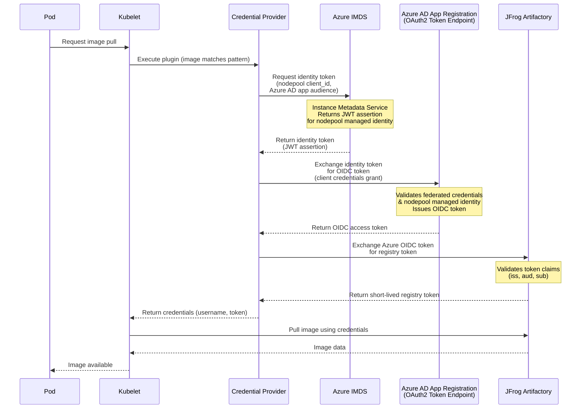
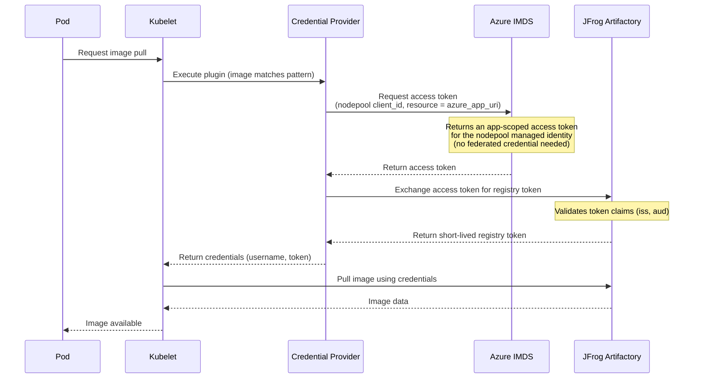

# 🔷 Azure AKS Setup Guide

This guide walks you through setting up the JFrog Kubelet Credential Provider on Azure Kubernetes Service (AKS) from scratch.

For **OpenShift on Azure** (including Azure Red Hat OpenShift), see [OpenShift.md](./OpenShift.md).

## 📋 Overview

The JFrog Credentials Provider authenticates with JFrog Artifactory via OpenID Connect (OIDC), eliminating manual image pull secret management by dynamically retrieving credentials when pulling container images.

There are **three** ways to set this up (see [Setup Process](#-setup-process) for the full comparison):

- **Option A — Nodepool Managed Identity:** Azure AD app registration **+ federated credential**.
- **Option B — Workload Identity (projected SA tokens):** ⭐ **No Azure AD app registration at all** — the simplest and most scalable option; Artifactory trusts the cluster's OIDC issuer and the workload's Kubernetes Service Account directly.
- **Option C — IMDS Direct:** Azure AD app registration but **no federated credential** (uses an app-role assignment instead), to avoid Azure's federated-credential limit.

> The diagram and "How It Works" below describe **Option A** (federated credentials). Options B and C are simpler — see their dedicated sections ([4B](#step-4b-workload-identity--projected-service-account-tokens-no-app-registration), [4C](#imds-direct-authentication)).

### 🔄 How It Works (Option A)



```mermaid
sequenceDiagram
    participant Pod
    participant Kubelet
    participant Plugin as Credential Provider
    participant IMDS as Azure IMDS
    participant AzureADApp as Azure AD App Registration<br/>(OAuth2 Token Endpoint)
    participant Artifactory as JFrog Artifactory
    
    Pod->>Kubelet: Request image pull
    Kubelet->>Plugin: Execute plugin (image matches pattern)
    Plugin->>IMDS: Request identity token<br/>(nodepool client_id,<br/>Azure AD app audience)
    Note over IMDS: Instance Metadata Service<br/>Returns JWT assertion<br/>for nodepool managed identity
    IMDS-->>Plugin: Return identity token<br/>(JWT assertion)
    Plugin->>AzureADApp: Exchange identity token<br/>for OIDC token<br/>(client credentials grant)
    Note over AzureADApp: Validates federated credentials<br/>& nodepool managed identity<br/>Issues OIDC token
    AzureADApp-->>Plugin: Return OIDC access token
    Plugin->>Artifactory: Exchange Azure OIDC token<br/>for registry token
    Note over Artifactory: Validates token claims<br/>(iss, aud, sub)
    Artifactory-->>Plugin: Return short-lived registry token
    Plugin-->>Kubelet: Return credentials (username, token)
    Kubelet->>Artifactory: Pull image using credentials
    Artifactory-->>Kubelet: Image data
    Kubelet-->>Pod: Image available
```

**Key Components:**
- **Azure IMDS**: Instance Metadata Service provides the managed identity token (JWT assertion) for the nodepool's managed identity
- **Azure AD**: Validates the nodepool's managed identity via federated credentials and issues an OIDC token for the Azure AD app
- **Azure AD App Registration**: Azure app registration configured with federated credentials, mapped to Artifactory's OIDC provider
- **Federated Credentials**: Establishes trust between the AKS nodepool's managed identity and the Azure AD app registration
- **OIDC Token Exchange**: Artifactory validates the Azure OIDC token and issues a short-lived registry access token

For more information about the credential provider architecture, see the [main README](./README.md).

---

## ✅ Prerequisites

Before you begin, ensure you have the following:

- **Azure CLI** installed and authenticated (`az login`)
- **An existing AKS cluster** (or permissions to create one)
- **Access to JFrog Artifactory** with admin permissions
- **kubectl** configured to access your AKS cluster
- **Helm 3.x** (if using Helm deployment)

### 🔍 Verify Prerequisites

Run the following commands to verify your setup:

```bash
# Check Azure CLI
az --version

# Check kubectl access
kubectl get nodes

# Check Helm (if using)
helm version
```

---

## 🚀 Setup Process

There are **three authentication methods** available. They differ mainly in **whether they need an Azure AD app registration** and **whether they need a federated identity credential** — the two things that make Azure setups hard to scale.

| Option | Method | Azure AD app registration? | Federated credential? | Steps |
|--------|--------|:--:|:--:|-------|
| **A** | Nodepool Managed Identity | ✅ Required | ✅ Required | 1 → 2 → 3 → 4A → 5 |
| **B** | **Workload Identity (projected SA tokens)** | ❌ **Not needed** | ❌ **Not needed** | **4B → 5** |
| **C** | IMDS Direct | ✅ Required | ❌ **Not needed** | 1 → 2 → 4C → 5 |

- **Option A: Nodepool Managed Identity (federated credentials)** — The nodepool's user-assigned managed identity (UAMI) is exchanged for an Azure AD app token via a **federated identity credential**, then exchanged with Artifactory.
  > **Choose this when:** You want node-level identity and are not constrained by Azure's federated identity credential limit.

- **Option B: Workload Identity (projected service account tokens)** — ⭐ **The simplest, most scalable option, and it requires no Azure AD app registration at all.** The kubelet's projected Kubernetes service account token is sent **directly** to Artifactory, which trusts your cluster's OIDC issuer. There is no Azure AD app, no federated credential, and no `azure.workload.identity/client-id` annotation — each workload is identified purely by its Kubernetes Service Account (`sub`).
  > **Choose this when:** You want the least Azure setup, per-service-account isolation, and zero coupling to Azure AD app registrations.

- **Option C: IMDS Direct (no federated credentials)** — The nodepool UAMI fetches an app-scoped access token **directly from Azure IMDS** (using an app-role assignment instead of a federated credential) and sends it straight to Artifactory.
  > **Choose this when:** You need a node-level identity but are hitting (or want to avoid) Azure's **federated identity credential limit** — a single app registration supports only a limited number of federated credentials. Option C needs none, so one app registration can serve any number of clusters and nodepools.

The setup steps are:

1. **Identify Azure Cloud Name** — Azure cloud environment (Options A and C; optional for `AzureCloud`)
2. **Azure AD App Registration** — Create the app registration (**Options A and C only — Option B needs no app registration**)
3. **Federated Identity Credentials** — Trust the nodepool UAMI (**Option A only**)
4. **JFrog Artifactory OIDC Configuration** — Choose one of:
   - **Step 4A:** Nodepool Managed Identity (federated credentials)
   - **Step 4B:** Workload Identity — projected SA tokens (**no app registration**)
   - **Step 4C:** IMDS Direct (no federated credentials)
5. **Deploy Credentials Provider** — Deploy with Helm

---

## Step 1: 🌍 Identify Azure Cloud Name and Endpoints

Before configuring the credential provider, you need to identify which Azure cloud environment you're using and set the appropriate endpoints. Different Azure clouds have different endpoints for Microsoft Graph and Active Directory authentication.

> **ℹ️ Note:** If you are using the default Azure public cloud (`AzureCloud`), `azure_cloud_name` is optional and defaults to `AzureCloud`. You can skip setting it in your Helm values. For sovereign clouds like `AzureChinaCloud`, you must set it explicitly.

### 🔍 Determine Your Azure Cloud and Endpoints

Azure operates in multiple sovereign clouds, each with different service endpoints. Identify your cloud environment from the table below and set the corresponding variables:

| Cloud Name | Microsoft Graph (`GRAPH_ENDPOINT`) | Active Directory (`AD_ENDPOINT`) |
|------------|----------------|------------------|
| `AzureCloud` | `https://graph.microsoft.com` | `https://login.microsoftonline.com` |
| `AzureChinaCloud` | `https://microsoftgraph.chinacloudapi.cn` | `https://login.partner.microsoftonline.cn` |

Set the variables based on your cloud environment:

```bash
# Get your Azure cloud name from the active cloud eg. AzureCloud, AzureChinaCloud
CLOUD_NAME=$(az cloud show --query name -o tsv)

# Set the endpoints from the table above based on your CLOUD_NAME
GRAPH_ENDPOINT="https://graph.microsoft.com"
AD_ENDPOINT="https://login.microsoftonline.com"

echo "Azure Cloud Name: $CLOUD_NAME"
echo "Microsoft Graph Endpoint: $GRAPH_ENDPOINT"
echo "Active Directory Endpoint: $AD_ENDPOINT"
```

> **💾 Important:** Save these values for later use:
> - `CLOUD_NAME` (also called `azure_cloud_name`)
> - `GRAPH_ENDPOINT` (used in subsequent steps for Azure AD API calls)
> - `AD_ENDPOINT` (used as the issuer URL for OIDC configuration)

---

## Step 2: 🔐 Azure AD App Registration

The Azure AD App Registration serves as the identity that authenticates with JFrog Artifactory via OIDC.

**Flow Overview:**
1. The credential provider requests an identity token from Azure IMDS using the nodepool's managed identity, targeting the Azure AD app registration audience

2. Azure AD validates the managed identity via federated credentials and returns an identity token (JWT assertion)

3. The provider exchanges the identity token for an OIDC access token from Azure AD using the OAuth2 client credentials grant flow

4. The provider exchanges the Azure OIDC token with Artifactory, which validates it and returns a short-lived registry access token

5. The kubelet uses the registry token to authenticate and pull the container image

For more information about Azure AD applications, see the [Azure AD App Registrations documentation](https://learn.microsoft.com/en-us/azure/active-directory/develop/quickstart-register-app).

### ➕ Create Azure AD Application

```bash
# Set variables
APP_DISPLAY_NAME="jfrog-credentials-provider-aks"
TENANT_ID=$(az account show --query tenantId -o tsv)

# Create the application
APP_CLIENT_ID=$(az ad app create \
  --display-name "$APP_DISPLAY_NAME" \
  --query appId -o tsv)

echo "Application Client ID: $APP_CLIENT_ID"
echo "Tenant ID: $TENANT_ID"
```

> **💾 Important:** Save these values for later use:
> - `APP_CLIENT_ID` (also called `azure_app_client_id`)
> - `TENANT_ID` (also called `azure_tenant_id`)

### 👤 Create Service Principal

```bash
# Create service principal for the application
az ad sp create --id "$APP_CLIENT_ID"
```

### 🔒 Enable Assignment Required (Recommended)

By default, **Assignment Required** is set to **No** on the enterprise application. This means any user or service principal in your tenant can acquire an access token from the app registration. Since the JFrog Credential Provider exchanges this token with Artifactory for image pull credentials, leaving this open is a security concern.

Setting **Assignment Required** to **Yes** ensures that only explicitly assigned principals can obtain tokens from the app.

**Enable via Azure Portal:**

1. Navigate to **Azure Portal** → **Enterprise applications**
2. Search for your application by name
3. Go to **Properties**
4. Set **Assignment required?** to **Yes**
5. Click **Save**

**Enable via Azure CLI:**

```bash
SPN_OBJECT_ID=$(az ad sp list --filter "appId eq '$APP_CLIENT_ID'" --query "[0].id" -o tsv)

az rest --method PATCH \
  --uri "$GRAPH_ENDPOINT/v1.0/servicePrincipals/$SPN_OBJECT_ID" \
  --headers "Content-Type=application/json" \
  --body '{"appRoleAssignmentRequired": true}'
```

After enabling this, the credential provider will fail to obtain tokens because the app's own service principal is not assigned. To fix this, assign the service principal to itself by creating an app role and assigning it:

**1. Create an App Role**

Navigate to **Azure Portal** → **App registrations** → your app → **App roles** → **Create app role**:
- **Display name**: e.g., `Task.Read`
- **Allowed member types**: Applications
- **Value**: `Task.Read`
- **Description**: Role for credential provider access

Or via CLI:

```bash
OBJECT_ID=$(az ad app show --id "$APP_CLIENT_ID" --query "id" -o tsv)

az rest --method PATCH \
  --uri "$GRAPH_ENDPOINT/v1.0/applications/$OBJECT_ID" \
  --headers "Content-Type=application/json" \
  --body '{
    "appRoles": [{
      "allowedMemberTypes": ["Application"],
      "displayName": "Task.Read",
      "id": "'$(uuidgen)'",
      "isEnabled": true,
      "description": "Role for credential provider access",
      "value": "Task.Read"
    }]
  }'
```

**2. Get the SPN Object ID and Role ID**

```bash
SPN_OBJECT_ID=$(az ad sp list --filter "appId eq '$APP_CLIENT_ID'" --query "[0].id" -o tsv)
ROLE_ID=$(az ad sp show --id "$SPN_OBJECT_ID" --query "appRoles[?value=='Task.Read'].id" -o tsv)
```

**3. Assign the Service Principal to itself**

```bash
az rest --method POST \
  --uri "$GRAPH_ENDPOINT/v1.0/servicePrincipals/$SPN_OBJECT_ID/appRoleAssignments" \
  --headers "Content-Type=application/json" \
  --body "{
    \"principalId\": \"$SPN_OBJECT_ID\",
    \"resourceId\": \"$SPN_OBJECT_ID\",
    \"appRoleId\": \"$ROLE_ID\"
  }"
```

After this, the credential provider will continue to work via the federated credentials on the nodepool managed identity, but other apps in your tenant will no longer be able to obtain tokens from this app registration.

### ⚙️ Configure Access Token Version

The credential provider uses the Active Directory endpoint (e.g., `$AD_ENDPOINT`) as the issuer URL. Azure requires you to set `requestedAccessTokenVersion` to `2` for this to work.

```bash
# Get the object ID of the app created above
OBJECT_ID=$(az ad app show --id "$APP_CLIENT_ID" --query "id" -o tsv)

# Update the access token version
az rest --method PATCH \
  --headers "Content-Type=application/json" \
  --uri "$GRAPH_ENDPOINT/v1.0/applications/$OBJECT_ID" \
  --body '{"api":{"requestedAccessTokenVersion": 2}}'
```

**🌐 Alternative: Configure via Azure Portal**

1. Navigate to **Azure Portal** → **Azure Active Directory** → **App registrations**
2. Search for your application by name or client ID
3. Go to **Manifest**
4. Set `"requestedAccessTokenVersion": 2` in the JSON
5. Click **Save**

> **💾 Important:** For AzureChinaCloud, the key will be:
> `"accessTokenAcceptedVersion": 2`

---

## Step 3: 🔗 Federated Identity Credentials

Federated credentials allow the AKS nodepool's managed identity to exchange tokens with the Azure AD App Registration. This establishes trust between your AKS cluster and Azure AD.

For more information, see the [Azure Managed Identities documentation](https://learn.microsoft.com/en-us/azure/active-directory/managed-identities-azure-resources/).

### 📊 Get AKS Cluster Information

```bash
# Set your cluster details
RESOURCE_GROUP="your-resource-group"
CLUSTER_NAME="your-aks-cluster"

# Get the kubelet identity object ID (this is what we'll use for federated credentials)
KUBELET_IDENTITY_OBJECT_ID=$(az aks show \
  --resource-group "$RESOURCE_GROUP" \
  --name "$CLUSTER_NAME" \
  --query "identityProfile.kubeletidentity.objectId" -o tsv)

KUBELET_IDENTITY_CLIENT_ID=$(az aks show \
  --resource-group "$RESOURCE_GROUP" \
  --name "$CLUSTER_NAME" \
  --query "identityProfile.kubeletidentity.clientId" -o tsv)

echo "Kubelet Identity Object ID: $KUBELET_IDENTITY_OBJECT_ID"
echo "Kubelet Identity Client ID: $KUBELET_IDENTITY_CLIENT_ID"
```

### 📌 Get the User-Assigned Managed Identity (Nodepool Client ID)

The `azure_nodepool_client_id` is the client ID of the user-assigned managed identity that is attached to your AKS nodepool. This is the same identity that you add to the federated credentials of the app registration (in the next step).

The credential provider runs on the node and uses this managed identity to request an identity token from Azure IMDS, which is then exchanged for an OIDC access token from the app registration.

```bash
# Get the node resource group
NODE_RESOURCE_GROUP=$(az aks show \
  --resource-group "$RESOURCE_GROUP" \
  --name "$CLUSTER_NAME" \
  --query "nodeResourceGroup" -o tsv)

# Get nodepool identity name (usually <cluster-name>-agentpool)
NODEPOOL_IDENTITY_NAME=$(az identity list \
  --resource-group "$NODE_RESOURCE_GROUP" \
  --query "[?contains(name, 'agentpool')].name" -o tsv | head -1)

# Get the object ID (needed for the federated credential subject)
NODEPOOL_IDENTITY_OBJECT_ID=$(az identity show \
  --resource-group "$NODE_RESOURCE_GROUP" \
  --name "$NODEPOOL_IDENTITY_NAME" \
  --query "principalId" -o tsv)

# Get the client ID (needed for the credential provider config)
NODEPOOL_CLIENT_ID=$(az identity show \
  --resource-group "$NODE_RESOURCE_GROUP" \
  --name "$NODEPOOL_IDENTITY_NAME" \
  --query "clientId" -o tsv)

echo "Nodepool Identity Object ID: $NODEPOOL_IDENTITY_OBJECT_ID"
echo "Nodepool Client ID: $NODEPOOL_CLIENT_ID"
```

> **💾 Important:** Save `NODEPOOL_CLIENT_ID` - this is your `azure_nodepool_client_id`.
> This identity must also be added as the **subject** in the federated credential of the app registration (see next step).

### ➕ Create Federated Identity Credential

```bash
# Use the kubelet identity object ID (or nodepool if different)
FEDERATED_CREDENTIAL_NAME="aks-nodepool-federated-credential"
AUDIENCE="api://AzureADTokenExchange"
ISSUER="$AD_ENDPOINT/$TENANT_ID/v2.0"

# Create the federated credential
az ad app federated-credential create \
  --id "$APP_CLIENT_ID" \
  --parameters "{
    \"name\": \"$FEDERATED_CREDENTIAL_NAME\",
    \"issuer\": \"$ISSUER\",
    \"subject\": \"$KUBELET_IDENTITY_OBJECT_ID\",
    \"audiences\": [\"$AUDIENCE\"],
    \"description\": \"Federated credential for AKS nodepool managed identity\"
  }"
```

### ✅ Verify Federated Credential

```bash
# List federated credentials
az ad app federated-credential list --id "$APP_CLIENT_ID"
```

You should see your federated credential with:
- `issuer`: `<AD_ENDPOINT>/<TENANT_ID>/v2.0` (e.g., `https://login.microsoftonline.com/<TENANT_ID>/v2.0` for AzureCloud)
- `subject`: Your kubelet/nodepool identity object ID
- `audiences`: `["api://AzureADTokenExchange"]`

---

## Step 4A: 🐸 JFrog Artifactory OIDC Configuration

Configure JFrog Artifactory to accept OIDC tokens from Azure. This involves creating an OIDC provider and an identity mapping in Artifactory.

For more information, see the [JFrog Artifactory OIDC Documentation](https://www.jfrog.com/confluence/display/JFROG/Access+Tokens#AccessTokens-OIDCIntegration).

### 🔑 Get Artifactory Admin Token

You'll need an Artifactory admin access token to configure OIDC. If you don't have one, create it in Artifactory under **Administration** → **Identity and Access** → **Access Tokens**.

```bash
# Set your Artifactory details
ARTIFACTORY_URL="your-instance.jfrog.io"
ARTIFACTORY_ADMIN_TOKEN="your-admin-access-token"
ARTIFACTORY_USER="azure-aks-user"  # User that will be mapped to OIDC tokens
OIDC_PROVIDER_NAME="azure-aks-oidc-provider"  # Choose a name
```

### ➕ Create OIDC Provider in Artifactory

```bash
curl -X POST "https://$ARTIFACTORY_URL/access/api/v1/oidc" \
  -H "Content-Type: application/json" \
  -H "Authorization: Bearer $ARTIFACTORY_ADMIN_TOKEN" \
  -d "{
    \"name\": \"$OIDC_PROVIDER_NAME\",
    \"issuer_url\": \"$AD_ENDPOINT/$TENANT_ID/v2.0\",
    \"description\": \"OIDC provider for Azure AKS\",
    \"provider_type\": \"Azure\",
    \"token_issuer\": \"$AD_ENDPOINT/$TENANT_ID/v2.0\",
    \"azure_app_id\": \"$APP_CLIENT_ID\",
    \"audience\": \"$APP_CLIENT_ID\",
    \"use_default_proxy\": false
  }"
```

For more details, see the [JFrog REST API documentation for creating OIDC configuration](https://jfrog.com/help/r/jfrog-rest-apis/create-oidc-configuration).

### 🗺️ Create Identity Mapping

The identity mapping tells Artifactory how to map Azure OIDC tokens to Artifactory users.

> **⚠️ Important:** Ensure `expires_in` is longer than the expiry set in your daemonset. The default is **4 hours (14400 seconds)**. The example below uses 14400 seconds to match the default daemonset expiry.

```bash
curl -X POST "https://$ARTIFACTORY_URL/access/api/v1/oidc/$OIDC_PROVIDER_NAME/identity_mappings" \
  -H "Content-Type: application/json" \
  -H "Authorization: Bearer $ARTIFACTORY_ADMIN_TOKEN" \
  -d "{
    \"name\": \"$OIDC_PROVIDER_NAME\",
    \"description\": \"Azure OIDC identity mapping\",
    \"claims\": {
      \"aud\": \"$APP_CLIENT_ID\",
      \"iss\": \"$AD_ENDPOINT/$TENANT_ID/v2.0\"
    },
    \"token_spec\": {
      \"username\": \"$ARTIFACTORY_USER\",
      \"scope\": \"applied-permissions/user\",
      \"audience\": \"*@*\",
      \"expires_in\": 14400
    },
    \"priority\": 1
  }"
```

<details>
<summary><strong>📝 Configuration Notes</strong></summary>

- The `claims.aud` must match your `azure_app_client_id`
- The `claims.iss` must match the Azure AD issuer URL: `$AD_ENDPOINT/$TENANT_ID/v2.0` (e.g., `https://login.microsoftonline.com/$TENANT_ID/v2.0` for AzureCloud)
- The `token_spec.username` must be an existing Artifactory user
- Ensure the user has permissions to pull images from your repositories

</details>

For more information, see the [JFrog Platform Administration documentation on identity mappings](https://jfrog.com/help/r/jfrog-platform-administration-documentation/identity-mappings).

### ✅ Verify OIDC Provider

```bash
# List OIDC providers
curl -X GET "https://$ARTIFACTORY_URL/access/api/v1/oidc" \
  -H "Authorization: Bearer $ARTIFACTORY_ADMIN_TOKEN" | jq

# Get specific provider details
curl -X GET "https://$ARTIFACTORY_URL/access/api/v1/oidc/$OIDC_PROVIDER_NAME" \
  -H "Authorization: Bearer $ARTIFACTORY_ADMIN_TOKEN" | jq
```

---

## Step 4B: Workload Identity — Projected Service Account Tokens (No App Registration)

> ⭐ **No Azure AD app registration is required for this flow.** You can skip Steps 1, 2, and 3 entirely. The pulling workload is identified purely by its **Kubernetes Service Account**, and Artifactory trusts your **cluster's OIDC issuer** directly. There is no Azure AD app, no federated credential, and no `azure.workload.identity/client-id` annotation.

This is the simplest and most scalable option. The kubelet projects the pulling pod's Service Account token and the credential provider sends it **straight to Artifactory**, which validates it against your cluster's OIDC issuer and the Service Account subject.

**Flow Overview:**

1. The kubelet projects a service account token for the pulling pod's Service Account (issued by the cluster's OIDC issuer).
2. The credential provider sends that projected token **directly** to Artifactory — there is no Azure AD or app registration involved.
3. Artifactory validates the token claims (`iss` = cluster OIDC issuer, `sub` = the Service Account) and returns a short-lived registry access token.
4. The kubelet uses the registry token to pull the container image.

> **ℹ️ What you do *not* need for this flow:** an Azure AD app registration, a federated identity credential, `azure_app_client_id`, or the `azure.workload.identity/client-id` annotation. The only Service Account annotation required is `JFrogExchange: "true"`.

### Step 4B.1: ✅ Enable OIDC Issuer on AKS

First, ensure your cluster has the OIDC issuer enabled to support Workload Identity:

```bash
# Set variables
RESOURCE_GROUP="your-resource-group"
CLUSTER_NAME="your-aks-cluster"

# Enable OIDC Issuer
az aks update \
  --resource-group "$RESOURCE_GROUP" \
  --name "$CLUSTER_NAME" \
  --enable-oidc-issuer

# Retrieve the OIDC Issuer URL (Save this for Artifactory config)
SERVICE_ACCOUNT_ISSUER=$(az aks show \
  --resource-group "$RESOURCE_GROUP" \
  --name "$CLUSTER_NAME" \
  --query "oidcIssuerProfile.issuerUrl" \
  -o tsv)

echo "Service Account Issuer: $SERVICE_ACCOUNT_ISSUER"
```

> **💾 Important:** Save the `SERVICE_ACCOUNT_ISSUER` URL - you'll need it for Artifactory OIDC configuration.

### Step 4B.2: 👤 Configure the Kubernetes Service Account

Create a Service Account that the Credential Provider will use to project the tokens:

```bash
# Set variables
NAMESPACE="jfrog"
SERVICE_ACCOUNT_NAME="jfrog-provider-sa"

# Create the namespace if it doesn't exist
kubectl create namespace "$NAMESPACE" --dry-run=client -o yaml | kubectl apply -f -

# Create the service account
kubectl create serviceaccount "$SERVICE_ACCOUNT_NAME" -n "$NAMESPACE" --dry-run=client -o yaml | kubectl apply -f -

# Annotate the service account with the JFrogExchange marker only.
# No azure.workload.identity/client-id annotation is needed for this flow.
kubectl annotate serviceaccount "$SERVICE_ACCOUNT_NAME" \
  -n "$NAMESPACE" \
  JFrogExchange="true" \
  --overwrite
```

> **ℹ️ Note:** The `JFrogExchange="true"` annotation is what tells the credential provider to use the projected service account token instead of the nodepool's managed identity. It is the **only** annotation required for this flow.

### Step 4B.3: 🐸 Update JFrog Artifactory OIDC Configuration

You must point Artifactory to your AKS Cluster's OIDC Issuer instead of the global Azure Login URL for this flow:

#### Update/Create OIDC Provider in Artifactory:

```bash
# Create or update the OIDC provider
curl -X POST "https://$ARTIFACTORY_URL/access/api/v1/oidc" \
  -H "Content-Type: application/json" \
  -H "Authorization: Bearer $ARTIFACTORY_ADMIN_TOKEN" \
  -d "{
    \"name\": \"aks-workload-identity\",
    \"issuer_url\": \"$SERVICE_ACCOUNT_ISSUER\",
    \"provider_type\": \"Azure\",
    \"token_issuer\": \"$SERVICE_ACCOUNT_ISSUER\",
    \"use_default_proxy\": false,
    \"description\": \"OIDC provider for Azure AKS Workload Identity\"
  }"
```

#### Create Identity Mapping for Service Account:

The mapping identifies the workload purely by its **Service Account subject** (`sub`) and your **cluster OIDC issuer** (`iss`) — no Azure app or audience is involved:

```bash
curl -X POST "https://$ARTIFACTORY_URL/access/api/v1/oidc/aks-workload-identity/identity_mappings" \
  -H "Content-Type: application/json" \
  -H "Authorization: Bearer $ARTIFACTORY_ADMIN_TOKEN" \
  -d "{
    \"name\": \"aks-workload-identity-mapping\",
    \"description\": \"Azure AKS Workload Identity mapping\",
    \"claims\": {
      \"iss\": \"$SERVICE_ACCOUNT_ISSUER\",
      \"sub\": \"system:serviceaccount:${NAMESPACE}:${SERVICE_ACCOUNT_NAME}\"
    },
    \"token_spec\": {
      \"username\": \"$ARTIFACTORY_USER\",
      \"scope\": \"applied-permissions/user\",
      \"audience\": \"*@*\",
      \"expires_in\": 3600
    },
    \"priority\": 1
  }"
```

> **⚠️ Important:** The `sub` claim must exactly match the Kubernetes service account format: `system:serviceaccount:<namespace>:<service-account-name>`.
>
> **ℹ️ Note:** The mapping only needs `iss` + `sub`. If you also want to pin the token audience, set the projected token audience via `azure_app_audience` in your Helm values (it becomes the token's `aud`) and add a matching `aud` claim here — but this is optional.

---

<a id="imds-direct-authentication"></a>

## Step 4C: 🆕 IMDS Direct Authentication (No Federated Credentials)

**Option C** uses the AKS nodepool's user-assigned managed identity to request an **app-scoped access token directly from Azure IMDS** and sends that token straight to Artifactory. Unlike Option A, it does **not** perform a client-assertion exchange against the Azure AD token endpoint, so it does **not** require a federated identity credential on the app registration.

Because Azure limits the number of federated identity credentials per app registration, Options A and B can become a scaling bottleneck across many clusters/nodepools. IMDS Direct removes that limit entirely — a single app registration can serve any number of nodepools.

**Flow Overview:**


```mermaid
sequenceDiagram
    participant Pod
    participant Kubelet
    participant Plugin as Credential Provider
    participant IMDS as Azure IMDS
    participant Artifactory as JFrog Artifactory

    Pod->>Kubelet: Request image pull
    Kubelet->>Plugin: Execute plugin (image matches pattern)
    Plugin->>IMDS: Request access token<br/>(nodepool client_id, resource = azure_app_uri)
    Note over IMDS: Returns an app-scoped access token<br/>for the nodepool managed identity<br/>(no federated credential needed)
    IMDS-->>Plugin: Return access token
    Plugin->>Artifactory: Exchange access token for registry token
    Note over Artifactory: Validates token claims (iss, aud)
    Artifactory-->>Plugin: Return short-lived registry token
    Plugin-->>Kubelet: Return credentials (username, token)
    Kubelet->>Artifactory: Pull image using credentials
    Artifactory-->>Kubelet: Image data
    Kubelet-->>Pod: Image available
```

Instead of a federated credential, the nodepool's managed identity is granted an **app role assignment** on the app's service principal. With **Assignment required = true**, that assignment is what authorizes the managed identity to request an app-scoped token from IMDS.

### 4C.1: Prepare the App Registration

Complete **Step 2** to create the app registration and service principal and set `requestedAccessTokenVersion: 2`. Then set the **Application ID URI** (the `resource` the credential provider requests). It defaults to `api://<client-id>`:

```bash
# APP_CLIENT_ID and TENANT_ID from Step 2
APP_ID_URI="api://${APP_CLIENT_ID}"

az ad app update --id "$APP_CLIENT_ID" --identifier-uris "$APP_ID_URI"
echo "APP_ID_URI=$APP_ID_URI"
```

> **ℹ️ For Option C you do NOT need** the federated credential (Step 3), nor the custom app role / "assign the SP to itself" sub-steps from Step 2. Instead, you assign the nodepool managed identity below.

### 4C.2: Require assignment and assign the nodepool managed identity

```bash
# Service principal (object ID) of the app registration
APP_SP_OBJECT_ID=$(az ad sp list --filter "appId eq '$APP_CLIENT_ID'" --query "[0].id" -o tsv)

# Require explicit assignment so only authorized identities can get a token for this app
az rest --method PATCH \
  --uri "$GRAPH_ENDPOINT/v1.0/servicePrincipals/$APP_SP_OBJECT_ID" \
  --headers "Content-Type=application/json" \
  --body '{"appRoleAssignmentRequired": true}'

# Object ID of the nodepool's user-assigned managed identity (see Step 3 for how to find NODEPOOL_IDENTITY_NAME / NODE_RESOURCE_GROUP)
UAMI_OBJECT_ID=$(az identity show \
  --resource-group "$NODE_RESOURCE_GROUP" \
  --name "$NODEPOOL_IDENTITY_NAME" \
  --query "principalId" -o tsv)

# Assign the managed identity to the app using the implicit "default access" role.
# This role (all-zeros GUID) satisfies appRoleAssignmentRequired without authoring a custom role.
az rest --method POST \
  --uri "$GRAPH_ENDPOINT/v1.0/servicePrincipals/$UAMI_OBJECT_ID/appRoleAssignments" \
  --headers "Content-Type=application/json" \
  --body "{
    \"principalId\": \"$UAMI_OBJECT_ID\",
    \"resourceId\": \"$APP_SP_OBJECT_ID\",
    \"appRoleId\": \"00000000-0000-0000-0000-000000000000\"
  }"
```

You also need the nodepool managed identity's **client ID** (`azure_nodepool_client_id`) for the Helm values — retrieve it with the commands in [Step 3 → Get the User-Assigned Managed Identity](#-get-the-user-assigned-managed-identity-nodepool-client-id).

### 4C.4: 🐸 JFrog Artifactory OIDC Configuration

Create an OIDC provider and identity mapping pointing at your **Azure AD tenant issuer**:

```bash
# OIDC provider (Azure AD tenant issuer)
curl -X POST "https://$ARTIFACTORY_URL/access/api/v1/oidc" \
  -H "Content-Type: application/json" \
  -H "Authorization: Bearer $ARTIFACTORY_ADMIN_TOKEN" \
  -d "{
    \"name\": \"$OIDC_PROVIDER_NAME\",
    \"issuer_url\": \"$AD_ENDPOINT/$TENANT_ID/v2.0\",
    \"provider_type\": \"Azure\",
    \"token_issuer\": \"$AD_ENDPOINT/$TENANT_ID/v2.0\",
    \"azure_app_id\": \"$APP_CLIENT_ID\",
    \"audience\": \"$APP_CLIENT_ID\",
    \"use_default_proxy\": false,
    \"description\": \"OIDC provider for Azure AKS IMDS Direct\"
  }"

# Identity mapping
curl -X POST "https://$ARTIFACTORY_URL/access/api/v1/oidc/$OIDC_PROVIDER_NAME/identity_mappings" \
  -H "Content-Type: application/json" \
  -H "Authorization: Bearer $ARTIFACTORY_ADMIN_TOKEN" \
  -d "{
    \"name\": \"$OIDC_PROVIDER_NAME-mapping\",
    \"description\": \"Azure IMDS Direct identity mapping\",
    \"claims\": {
      \"aud\": \"$APP_CLIENT_ID\",
      \"iss\": \"$AD_ENDPOINT/$TENANT_ID/v2.0\"
    },
    \"token_spec\": {
      \"username\": \"$ARTIFACTORY_USER\",
      \"scope\": \"applied-permissions/user\",
      \"audience\": \"*@*\",
      \"expires_in\": 14400
    },
    \"priority\": 1
  }"
```

> **ℹ️ Note:** `claims.aud` is the **bare app client ID** and `claims.iss` is the `v2.0` issuer (as verified in [4C.3](#4c3-optional-verify-the-imds-token-from-a-node)). The `token_spec.audience` (`*@*`) is matched by `jfrog_token_audience` (default `*@*`); only change it if you intentionally narrow the resulting Artifactory token's audience.

### Helm values

See [`examples/azure-non-federated-values.yaml`](./examples/azure-non-federated-values.yaml).

```yaml
providerConfig:
  - name: jfrog-credentials-provider
    artifactoryUrl: "<your-instance-dns>"
    matchImages:
      - "<registry-pattern>"
    defaultCacheDuration: 5h
    azure:
      enabled: true
      azure_auth_method: "imds_direct"      # required: selects the IMDS Direct flow
      azure_app_client_id: "<app-client-id>"
      azure_nodepool_client_id: "<nodepool-client-id>"
      jfrog_oidc_provider_name: "<oidc-provider-name>"
      # azure_app_uri: "api://<app-client-id>"   # optional, defaults to api://<azure_app_client_id>
      # azure_cloud_name: "AzureCloud"           # optional, defaults to AzureCloud

```

> **⚠️ Mutually exclusive with Workload Identity:** Do not combine `azure_auth_method: imds_direct` with `tokenAttributes.enabled: true` — the chart fails validation. IMDS Direct is a node-identity flow, so it does not use projected service account tokens.

---

## Step 5: 🚀 Deploy Credentials Provider

Deploy the credential provider using Helm. For manual deployment with Kubernetes manifests, refer to the [Kubernetes Kubelet Credential Provider documentation](https://kubernetes.io/docs/tasks/administer-cluster/kubelet-credential-provider/).

### 📝 Prepare Values File

Example values files are provided for each authentication method:

- [`./examples/azure-values.yaml`](./examples/azure-values.yaml) — Values file for the Nodepool Managed Identity approach (Option A).
- [`./examples/azure-projected-sa-values.yaml`](./examples/azure-projected-sa-values.yaml) — Values file for the Workload Identity approach using projected service account tokens (Option B).
- [`./examples/azure-non-federated-values.yaml`](./examples/azure-non-federated-values.yaml) — Values file for the IMDS Direct approach without federated credentials (Option C).

Update the relevant file with your configuration values.

You can use the following commands to print the values you need:

```bash
echo "artifactory_url: $ARTIFACTORY_URL"
echo "azure_cloud_name: $CLOUD_NAME"
echo "azure_tenant_id: $TENANT_ID"
echo "azure_app_client_id: $APP_CLIENT_ID"
echo "azure_nodepool_client_id: $NODEPOOL_CLIENT_ID"
echo "azure_app_audience: api://AzureADTokenExchange"
echo "jfrog_oidc_provider_name: $OIDC_PROVIDER_NAME"
```

| Configuration Value | Description | Example |
|---------------------|-------------|---------|
| `azure_auth_method` | (Optional) Set to `imds_direct` for Option C (IMDS Direct). Omit (empty) for Options A and B. | `imds_direct` |
| `azure_cloud_name` | Your Azure Cloud Name (optional, defaults to `AzureCloud`) | `AzureCloud` `AzureChinaCloud` |
| `azure_tenant_id` | Your Azure AD tenant ID (Option A only) | `12345678-1234-1234-1234-123456789012` |
| `azure_app_client_id` | The Azure AD application client ID (Options A and C; **not used by Option B**) | `87654321-4321-4321-4321-210987654321` |
| `azure_app_uri` | (Optional) Resource URI requested from IMDS for Option C. Defaults to `api://<azure_app_client_id>`. | `api://87654321-...` |
| `azure_nodepool_client_id` | Client ID of the user-assigned managed identity attached to the AKS nodepool (also added to the app registration's federated credential for Option A) | `11111111-2222-3333-4444-555555555555` |
| `azure_app_audience` | The OIDC audience (the projected token audience for Option B) | `api://AzureADTokenExchange` |
| `jfrog_token_audience` | (Optional) Audience requested for the resulting Artifactory token during the OIDC exchange. Defaults to `*@*`. Only set if your identity mapping uses a non-wildcard `token_spec.audience`. | `*@*` |
| `jfrog_oidc_provider_name` | The name of the OIDC provider in Artifactory | `azure-aks-oidc-provider` |
| `artifactory_url` | Your JFrog Artifactory URL | `your-instance.jfrog.io` |

#### Configuration for Traditional Nodepool Identity

Use this configuration if you're using the **nodepool's managed identity** (Steps 2-4A):

```yaml
providerConfig:
  - name: jfrog-credentials-provider
    artifactoryUrl: "<your-instance-dns>"
    matchImages:
      - "<registry-pattern>"
    defaultCacheDuration: 5m
    tokenAttributes:
      enabled: false  # Set to false for nodepool identity
    azure:
      enabled: true
      azure_cloud_name: "<cloud-name>"  # Optional, defaults to AzureCloud
      azure_tenant_id: "<tenant-id>"
      azure_app_client_id: "<app-client-id>"
      azure_nodepool_client_id: "<nodepool-client-id>"
      azure_app_audience: "<app-audience>"
      jfrog_oidc_provider_name: "<oidc-provider-name>"

rbac:
  create: true
```

#### Configuration for Workload Identity (Projected Service Account Tokens)

Use this configuration if you're using **Kubernetes Workload Identity** (Step 4B). **No Azure AD app registration is involved** — there is no `azure_app_client_id`, no tenant ID, and no cloud name:

```yaml
providerConfig:
  - name: jfrog-credentials-provider
    artifactoryUrl: "<your-instance-dns>"
    matchImages:
      - "<registry-pattern>"
    defaultCacheDuration: 5m
    tokenAttributes:
      enabled: true  # Enable projected token support
      serviceAccountTokenAudience: "<app-audience>"  # the projected token's audience (e.g. api://AzureADTokenExchange)
    azure:
      enabled: true
      azure_app_audience: "<app-audience>"   # must match serviceAccountTokenAudience above
      jfrog_oidc_provider_name: "<oidc-provider-name>"
      # jfrog_token_audience: "*@*"          # Optional; defaults to *@*

rbac:
  create: true

# Note: You must also create the service account and annotate it with JFrogExchange="true" as described in Step 4B.2
```

#### Configuration for IMDS Direct (No Federated Credentials)

Use this configuration if you're using **IMDS Direct** (Step 4C):

```yaml
providerConfig:
  - name: jfrog-credentials-provider
    artifactoryUrl: "<your-instance-dns>"
    matchImages:
      - "<registry-pattern>"
    defaultCacheDuration: 5h
    # Do NOT set tokenAttributes.enabled: true here — it is mutually exclusive with imds_direct
    azure:
      enabled: true
      azure_auth_method: "imds_direct"
      azure_cloud_name: "<cloud-name>"  # Optional, defaults to AzureCloud
      azure_app_client_id: "<app-client-id>"
      azure_nodepool_client_id: "<nodepool-client-id>"
      jfrog_oidc_provider_name: "<oidc-provider-name>"
      # azure_app_uri: "api://<app-client-id>"   # Optional, defaults to api://<azure_app_client_id>
      # jfrog_token_audience: "*@*"              # Optional; defaults to *@*

rbac:
  create: true
```

> **ℹ️ Note:** When using Workload Identity, ensure the service account `jfrog-provider-sa` is annotated with `JFrogExchange="true"` (the only annotation required — see Step 4B.2).


### 📦 Install with Helm

#### Add JFrog Helm repository

Before installing JFrog helm charts, you need to add the [JFrog helm repository](https://charts.jfrog.io/) to your helm client

```bash
helm repo add jfrog https://charts.jfrog.io
helm repo update
```

#### Install the Credential Provider

**For Nodepool Managed Identity (Option A):**

```bash
helm upgrade --install secret-provider jfrog/jfrog-credential-provider \
  --namespace jfrog \
  --create-namespace \
  -f ./examples/azure-values.yaml
```

**For Workload Identity (Option B):**

```bash
helm upgrade --install secret-provider jfrog/jfrog-credential-provider \
  --namespace jfrog \
  --create-namespace \
  -f ./examples/azure-projected-sa-values.yaml
```

**For IMDS Direct (Option C):**

```bash
helm upgrade --install secret-provider jfrog/jfrog-credential-provider \
  --namespace jfrog \
  --create-namespace \
  -f ./examples/azure-non-federated-values.yaml
```

---

## ✅ Verification

After deployment, verify that the credential provider is working correctly.

### 📊 Check DaemonSet Status

```bash
kubectl get daemonset -n jfrog
kubectl get pods -n jfrog
```

All pods should be in `Running` state.

### 🧪 Test Image Pull

Create a test pod that pulls from your Artifactory registry:

```bash
# Get node names (if you deployed in a particular node group)
kubectl get nodes

# Create a test pod
kubectl run test-pull \
  --image=your-instance.jfrog.io/your-repo/test-image:latest \
  --restart=Never \
  --rm -it \
  --overrides='{"spec":{"nodeName":"your-node-name"}}'

# Check if it pulls successfully
kubectl describe pod test-pull
```


## 🔧 Troubleshooting

For troubleshooting help, see the [debug documentation](./debug.md).

---

## 📚 Additional Resources

- [Azure Managed Identities Documentation](https://learn.microsoft.com/en-us/azure/active-directory/managed-identities-azure-resources/)
- [Azure AD App Registrations](https://learn.microsoft.com/en-us/azure/active-directory/develop/quickstart-register-app)
- [Azure Enterprise Applications](https://learn.microsoft.com/en-us/entra/identity/enterprise-apps/add-application-portal)
- [JFrog Artifactory OIDC Documentation](https://www.jfrog.com/confluence/display/JFROG/Access+Tokens#AccessTokens-OIDCIntegration)
- [Kubernetes Kubelet Credential Provider](https://kubernetes.io/docs/tasks/administer-cluster/kubelet-credential-provider/)
- [Main README](./README.md)

