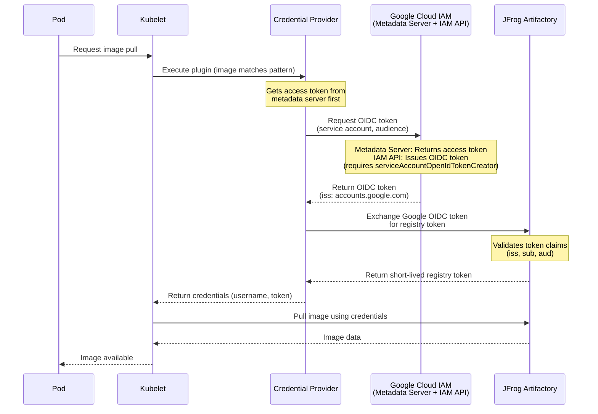

# 🔵 GCP GKE Setup Guide

This guide walks you through setting up the JFrog Kubelet Credential Provider on Google Cloud Platform (GCP) Google Kubernetes Engine (GKE) from scratch.

## 📋 Overview

The JFrog Credentials Provider uses Google Service Accounts with OIDC capabilities to authenticate with JFrog Artifactory via OpenID Connect (OIDC). This eliminates the need for manual image pull secret management by dynamically retrieving credentials when pulling container images.

### 🔄 How It Works



**Key Components:**
- **Service Account**: GKE node's service account
- **OIDC Token Creator Role**: Allows service account to generate OIDC tokens
- **OIDC Exchange**: Artifactory validates the OIC token and issues a registry token

For more information about the credential provider architecture, see the [main README](./README.md).

---

## ✅ Prerequisites

Before you begin, ensure you have the following:

- **Google Cloud SDK** (`gcloud`) installed and authenticated (`gcloud auth login`)
- **An existing GKE cluster** (or permissions to create one)
- **Access to JFrog Artifactory** with admin permissions
- **kubectl** configured to access your GKE cluster
- **Helm 3.x** (if using Helm deployment)

### 🔍 Verify Prerequisites

Run the following commands to verify your setup:

```bash
# Check Google Cloud SDK
gcloud --version

# Check kubectl access
kubectl get nodes

# Check Helm (if using)
helm version

# Verify you're authenticated
gcloud auth list
```

---

## 🚀 Setup Process

The setup process consists of four main steps:

1. **Google Cloud Service Account Setup** - Create and configure a service account with OIDC capabilities
2. **GKE Node Service Account Configuration** - Attach the service account to your GKE worker nodes
3. **JFrog Artifactory OIDC Configuration** - Configure Artifactory to accept Google OIDC tokens
4. **Deploy Credentials Provider** - Deploy the credential provider using Helm

---

## Step 1: 🔐 Google Cloud Service Account Setup

The Google Service Account is the identity that will authenticate with JFrog Artifactory via OIDC.

**Flow Overview:**
1. The credential provider requests an OAuth2 access token from GCP Metadata Server using the service account attached to the GKE node

2. The provider uses the access token to request an OIDC token from Google IAM Credentials API, specifying the Artifactory audience

3. Google IAM validates the service account (requires `roles/iam.serviceAccountOpenIdTokenCreator` role) and returns an OIDC token with issuer `accounts.google.com`

4. The provider exchanges the Google OIDC token with Artifactory, which validates it and returns a short-lived registry access token

5. The kubelet uses the registry token to authenticate and pull the container image

For more information about Google Service Accounts, see the [Google Cloud Service Accounts documentation](https://cloud.google.com/iam/docs/service-accounts).

### 📊 Set Your GCP Project

```bash
# Set your project ID
PROJECT_ID="your-gcp-project-id"
gcloud config set project "$PROJECT_ID"

# Verify the project
gcloud config get-value project
```

### ➕ Create Service Account

This service account is going to be attached to the worker nodes of your GKE cluster, and so should have the required permissions.

```bash
# Set variables
SERVICE_ACCOUNT_NAME="jfrog-credentials-provider"
SERVICE_ACCOUNT_DISPLAY_NAME="JFrog Credentials Provider for GKE"

# Create the service account
gcloud iam service-accounts create "$SERVICE_ACCOUNT_NAME" \
  --display-name="$SERVICE_ACCOUNT_DISPLAY_NAME" \
  --description="Service account for JFrog Credentials Provider on GKE"

SERVICE_ACCOUNT_EMAIL=$(gcloud iam service-accounts list \
  --filter="displayName:$SERVICE_ACCOUNT_DISPLAY_NAME" \
  --format="value(email)" \
  --limit=1)

echo "Service Account Email: $SERVICE_ACCOUNT_EMAIL"

```

> **💾 Important:** Save this value for later use:
> - `SERVICE_ACCOUNT_EMAIL` (also called `google_service_account_email`)

### ⚙️ Grant Required IAM Roles

The service account needs the `roles/iam.serviceAccountOpenIdTokenCreator` role to generate OIDC tokens:

```bash
# Grant the service account permission to create OIDC tokens
gcloud iam service-accounts add-iam-policy-binding "$SERVICE_ACCOUNT_EMAIL" \
  --member="serviceAccount:$SERVICE_ACCOUNT_EMAIL" \
  --role="roles/iam.serviceAccountOpenIdTokenCreator"
```

> **ℹ️ Note**: This role allows the service account to impersonate itself to generate OIDC tokens, which is required for the credential provider to work.

### 🔑 Get Service Account Unique ID

The service account's unique ID is used in the OIDC identity mapping for Artifactory:

```bash
# Get the service account unique ID
SERVICE_ACCOUNT_UNIQUE_ID=$(gcloud iam service-accounts describe "$SERVICE_ACCOUNT_EMAIL" \
  --format="value(uniqueId)")

echo "Service Account Unique ID: $SERVICE_ACCOUNT_UNIQUE_ID"
```

> **💾 Important:** Save this value - you'll need it for the Artifactory identity mapping.

---

## Step 2: ☸️ GKE Node Service Account Configuration

Use the service account created above as your worker node service account. Configure your GKE node pool to use this service account.

---

## Step 3: 🐸 JFrog Artifactory OIDC Configuration

Configure JFrog Artifactory to accept OIDC tokens from Google Cloud. This involves creating an OIDC provider and an identity mapping in Artifactory.

For more information, see the [JFrog Artifactory OIDC Documentation](https://www.jfrog.com/confluence/display/JFROG/Access+Tokens#AccessTokens-OIDCIntegration).

### 🔑 Get Artifactory Admin Token

You'll need an Artifactory admin access token to configure OIDC. If you don't have one, create it in Artifactory under **Administration** → **Identity and Access** → **Access Tokens**.

```bash
# Set your Artifactory details
ARTIFACTORY_URL="your-instance.jfrog.io"
ARTIFACTORY_ADMIN_TOKEN="your-admin-access-token"
ARTIFACTORY_USER="gcp-gke-user"  # User that will be mapped to OIDC tokens
OIDC_PROVIDER_NAME="gcp-gke-oidc-provider"  # Choose a name
```

### ➕ Create OIDC Provider in Artifactory

```bash
curl -X POST "https://$ARTIFACTORY_URL/access/api/v1/oidc" \
  -H "Content-Type: application/json" \
  -H "Authorization: Bearer $ARTIFACTORY_ADMIN_TOKEN" \
  -d "{
    \"name\": \"$OIDC_PROVIDER_NAME\",
    \"issuer_url\": \"https://accounts.google.com/\",
    \"description\": \"OIDC provider for GCP GKE\",
    \"provider_type\": \"Generic OpenID Connect\",
    \"token_issuer\": \"https://accounts.google.com\",
    \"use_default_proxy\": false
  }"
```

For more details, see the [JFrog REST API documentation for creating OIDC configuration](https://jfrog.com/help/r/jfrog-rest-apis/create-oidc-configuration).

### 🗺️ Create Identity Mapping

The identity mapping tells Artifactory how to map Google OIDC tokens to Artifactory users.

> **⚠️ Important:** Ensure `expires_in` is longer than the expiry set in your daemonset. The default is **5 hours (18000 seconds)** here, and **4 hours** in daemonset.

```bash
curl -X POST "https://$ARTIFACTORY_URL/access/api/v1/oidc/$OIDC_PROVIDER_NAME/identity_mappings" \
  -H "Content-Type: application/json" \
  -H "Authorization: Bearer $ARTIFACTORY_ADMIN_TOKEN" \
  -d "{
    \"name\": \"$OIDC_PROVIDER_NAME\",
    \"description\": \"GCP GKE OIDC identity mapping\",
    \"claims\": {
      \"iss\": \"https://accounts.google.com\",
      \"sub\": \"$SERVICE_ACCOUNT_UNIQUE_ID\"
    },
    \"token_spec\": {
      \"username\": \"$ARTIFACTORY_USER\",
      \"scope\": \"applied-permissions/user\",
      \"audience\": \"*@*\",
      \"expires_in\": 18000
    },
    \"priority\": 1
  }"
```

<details>
<summary><strong>📝 Configuration Notes</strong></summary>

- The `claims.iss` must match the Google issuer URL: `https://accounts.google.com`
- The `claims.sub` must match your service account's unique ID (not the email)
- The `token_spec.username` must be an existing Artifactory user
- Ensure the user has permissions to pull images from your repositories
- The audience in the OIDC token will be your GCP project ID

</details>

</details>
- The audience in the OIDC token will be your GCP project ID

For more information, see the [JFrog Platform Administration documentation on identity mappings](https://jfrog.com/help/r/jfrog-platform-administration-documentation/identity-mappings).

### ✅ Verify OIDC Provider

```bash
# List OIDC providers
curl -X GET "https://$ARTIFACTORY_URL/access/api/v1/oidc" \
  -H "Authorization: Bearer $ARTIFACTORY_ADMIN_TOKEN" | jq

# Get specific provider details
curl -X GET "https://$ARTIFACTORY_URL/access/api/v1/oidc/$OIDC_PROVIDER_NAME" \
  -H "Authorization: Bearer $ARTIFACTORY_ADMIN_TOKEN" | jq
```

---

## Step 4: 🚀 Deploy Credentials Provider

Deploy the credential provider using Helm. For manual deployment with Kubernetes manifests, refer to the [Kubernetes Kubelet Credential Provider documentation](https://kubernetes.io/docs/tasks/administer-cluster/kubelet-credential-provider/).

### 📝 Prepare Values File

Create or update the values file at `./examples/gcp-values.yaml` with your configuration values.

You can use the following commands to print the values you need:

```bash
echo "artifactory_url: $ARTIFACTORY_URL"
echo "google_service_account_email: $SERVICE_ACCOUNT_EMAIL"
echo "jfrog_oidc_audience: $PROJECT_ID"
echo "jfrog_oidc_provider_name: $OIDC_PROVIDER_NAME"
```

After completing the setup, you should have the following values:

| Configuration Value | Description | Example |
|---------------------|-------------|---------|
| `google_service_account_email` | The Google service account email | `jfrog-credentials-provider@project-id.iam.gserviceaccount.com` |
| `jfrog_oidc_provider_name` | The name of the OIDC provider in Artifactory | `gcp-gke-oidc-provider` |
| `jfrog_oidc_audience` | The GCP project ID (used as OIDC audience) | `your-gcp-project-id` |
| `artifactory_url` | Your JFrog Artifactory URL | `your-instance.jfrog.io` |

### 📦 Install with Helm

#### Add JFrog Helm repository

Before installing JFrog helm charts, you need to add the [JFrog helm repository](https://charts.jfrog.io/) to your helm client

```bash
helm repo add jfrog https://charts.jfrog.io
help repo update
```

And then install using the following command - 

```bash
# Install the credential provider
helm upgrade --install secret-provider jfrog/jfrog-credential-provider \
  --namespace jfrog \
  --create-namespace \
  -f ./examples/gcp-values.yaml --devel

```

---

## ✅ Verification

After deployment, verify that the credential provider is working correctly.

### 📊 Check DaemonSet Status

```bash
kubectl get daemonset -n jfrog
kubectl get pods -n jfrog
```

All pods should be in `Running` state.

### 🧪 Test Image Pull

Create a test pod that pulls from your Artifactory registry:

```bash
# If you deployed in a particular node group, find the node name to use in the next command
kubectl get nodes 

kubectl run test-pull \
  --image=your-instance.jfrog.io/your-repo/test-image:latest \
  --restart=Never \
  --rm -it \
  --overrides='{"spec":{"nodeName":"your-node-name"}}'

# Check if it pulls successfully
kubectl describe pod test-pull
```

---

## 🔧 Troubleshooting

For troubleshooting help, see the [debug documentation](./debug.md).

---

## 📚 Additional Resources

- [Google Cloud Service Accounts Documentation](https://cloud.google.com/iam/docs/service-accounts)
- [GKE Workload Identity](https://cloud.google.com/kubernetes-engine/docs/how-to/workload-identity)
- [Google Cloud IAM Roles](https://cloud.google.com/iam/docs/understanding-roles)
- [JFrog Artifactory OIDC Documentation](https://www.jfrog.com/confluence/display/JFROG/Access+Tokens#AccessTokens-OIDCIntegration)
- [Kubernetes Kubelet Credential Provider](https://kubernetes.io/docs/tasks/administer-cluster/kubelet-credential-provider/)
- [Main README](./README.md)

