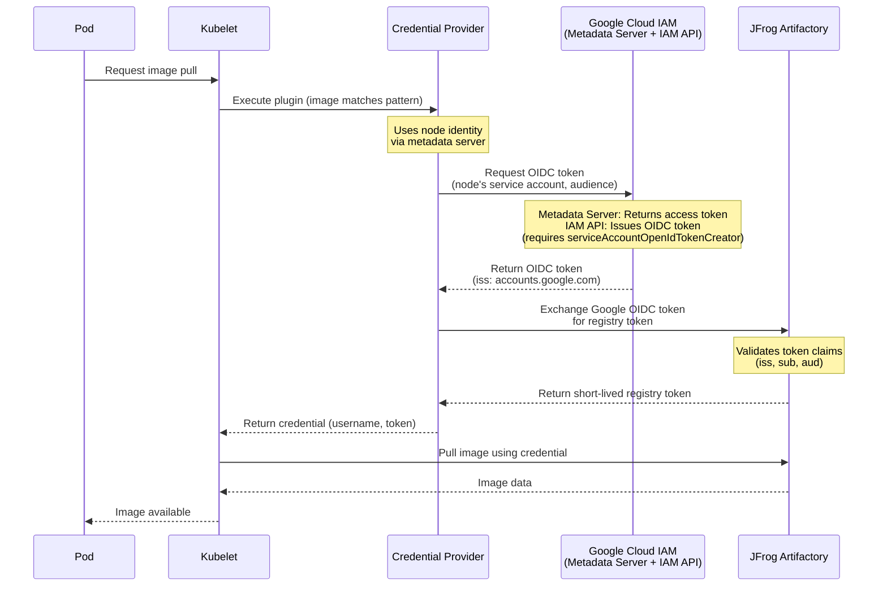
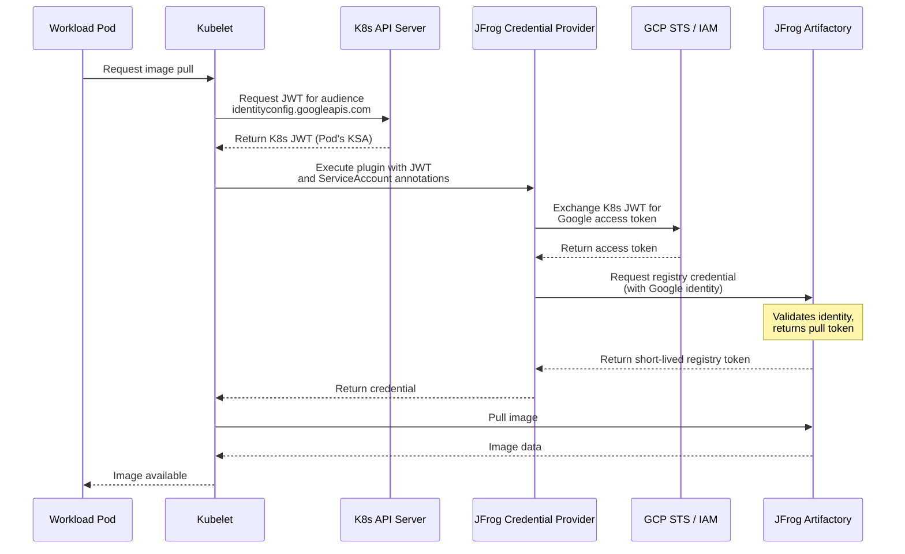

# 🔵 GCP GKE Setup Guide

This guide walks you through setting up the JFrog Kubelet Credential Provider on Google Cloud Platform (GCP) Google Kubernetes Engine (GKE) from scratch.

## 📋 Overview

The JFrog Credential Provider uses Google Service Accounts with OIDC capabilities to authenticate with JFrog Artifactory via OpenID Connect (OIDC). This eliminates the need for manual image pull secret management by dynamically retrieving credential when pulling container images.

There are **two authentication methods** available:

- **Option A: Node pool / Node-level identity** — The credential provider uses the GKE node's service account (via the node metadata server). All pods on the node share the same identity when pulling images.
- **Option B: Workload Identity (Pod-level identity)** — Uses GKE Workload Identity so that the Kubelet provides a Pod's Kubernetes Service Account (KSA) token to the plugin. The plugin exchanges the K8s JWT with GCP for a Google access token, and that identity is used with Artifactory. Image pull permissions are tied to the specific workload.

For more information about the credential provider architecture, see the [main README](./README.md).

### 🔄 How It Works — Option A (Node-level Identity)


```mermaid
sequenceDiagram
    participant Pod
    participant Kubelet
    participant Plugin as Credential Provider
    participant GCP as Google Cloud IAM<br/>(Metadata Server + IAM API)
    participant Artifactory as JFrog Artifactory
    
    Pod->>Kubelet: Request image pull
    Kubelet->>Plugin: Execute plugin (image matches pattern)
    Note over Plugin: Uses node identity<br/>via metadata server
    Plugin->>GCP: Request OIDC token<br/>(node's service account, audience)
    Note over GCP: Metadata Server: Returns access token<br/>IAM API: Issues OIDC token<br/>(requires serviceAccountOpenIdTokenCreator)
    GCP-->>Plugin: Return OIDC token<br/>(iss: accounts.google.com)
    Plugin->>Artifactory: Exchange Google OIDC token<br/>for registry token
    Note over Artifactory: Validates token claims<br/>(iss, sub, aud)
    Artifactory-->>Plugin: Return short-lived registry token
    Plugin-->>Kubelet: Return credential (username, token)
    Kubelet->>Artifactory: Pull image using credential
    Artifactory-->>Kubelet: Image data
    Kubelet-->>Pod: Image available
```

**Key components (Option A):**
- **Node service account**: GKE node's Google Service Account (GSA)
- **Metadata server**: Provides the node's identity to the plugin
- **OIDC token creator role**: Allows the GSA to generate OIDC tokens for the Artifactory audience
- **Artifactory**: Validates the Google OIDC token and issues a short-lived registry token

### 🔄 How It Works — Option B (Workload Identity / Pod-level)

With [KEP-4412](https://kubernetes.io/docs/reference/access-authn-authz/kubelet-credential-provider/) (Pod-level identity), the Kubelet uses the Pod's own ServiceAccount token to authorize image pulls. The JFrog Credential Provider can use GKE Workload Identity: the Kubelet gets a token for the Pod's identity and passes it to the plugin, which exchanges it with GCP and then with Artifactory.


```mermaid
sequenceDiagram
    participant WorkloadPod as Workload Pod
    participant Kubelet
    participant APIServer as K8s API Server
    participant Plugin as JFrog Credential Provider
    participant GCP as GCP STS / IAM
    participant Artifactory as JFrog Artifactory
    
    WorkloadPod->>Kubelet: Request image pull
    Kubelet->>APIServer: Request JWT for audience<br/>identityconfig.googleapis.com
    APIServer-->>Kubelet: Return K8s JWT (Pod's KSA)
    Kubelet->>Plugin: Execute plugin with JWT<br/>and ServiceAccount annotations
    Plugin->>GCP: Exchange K8s JWT for<br/>Google access token
    GCP-->>Plugin: Return access token
    Plugin->>Artifactory: Request registry credential<br/>(with Google identity)
    Note over Artifactory: Validates identity,<br/>returns pull token
    Artifactory-->>Plugin: Return short-lived registry token
    Plugin-->>Kubelet: Return credential
    Kubelet->>Artifactory: Pull image
    Artifactory-->>Kubelet: Image data
    Kubelet-->>WorkloadPod: Image available
```

**Key components (Option B):**
- **Kubernetes Service Account (KSA)**: The Pod uses a KSA annotated with `iam.gke.io/gcp-service-account` and `JFrogExchange: true`
- **GKE Workload Identity**: Binds the KSA to a Google Service Account (GSA) in the workload pool (`PROJECT_ID.svc.id.goog`)
- **TokenAttributes**: Kubelet requests a token with audience `identityconfig.googleapis.com` and passes it to the plugin
- **JFrog plugin**: Exchanges the K8s JWT with GCP for a Google access token, then with Artifactory for a registry token

### Key benefits (especially with Workload Identity — Option B)

- **Granular security**: Restrict sensitive images so only specific GSA identities (and thus specific workloads) can pull them, even on shared GKE nodes.
- **Zero static secrets**: No imagePullSecrets or long-lived Artifactory API keys on node disk; credential are derived from workload identity.
- **Audit trails**: Artifactory logs can capture the Kubernetes namespace and Google Service Account (and thus workload) for each image pull.
- **Compliance**: Aligns with least-privilege at the Pod level for external registry access.

---

## ✅ Prerequisites

Before you begin, ensure you have the following:

- **Google Cloud SDK** (`gcloud`) installed and authenticated (`gcloud auth login`)
- **An existing GKE cluster** (or permissions to create one)
- **Access to JFrog Artifactory** with admin permissions
- **kubectl** configured to access your GKE cluster
- **Helm 3.x** (if using Helm deployment)

### 🔍 Verify Prerequisites

Run the following commands to verify your setup:

```bash
# Check Google Cloud SDK
gcloud --version

# Check kubectl access
kubectl get nodes

# Check Helm (if using)
helm version

# Verify you're authenticated
gcloud auth list
```

---

## 🚀 Setup Process

Choose one of two paths:

- **Option A: Node pool / Node-level identity** — Steps 1 → 2A → 3A → 4  
  Use when all nodes in the pool can share the same identity and you do not need per-workload isolation.

- **Option B: Workload Identity (Pod-level)** — Steps 1 → 2B → 3B → 4  
  Use when you need per-service-account or per-pod identity, zero static secrets, and audit trails tied to workload identity.

Steps:

1. **Google Cloud Service Account** — Create a GCP service account with OIDC capabilities (shared).
2. **GKE identity configuration** — Choose one:
   - **Step 2A:** Attach the GSA to your GKE node pool (Option A)
   - **Step 2B:** Enable Workload Identity and bind Kubernetes Service Accounts to the GSA (Option B).
3. **JFrog Artifactory OIDC** — Choose one:
   - **Step 3A:** Configure Artifactory to accept Google OIDC tokens (Option A)
   - **Step 3B:** OIDC provider for Workload Identity with GKE as issuer (Option B).
4. **Deploy Credential Provider** — Deploy with the correct values for Option A or Option B.

---

## Step 1: 🔐 Google Cloud Service Account Setup (shared)

The Google Service Account (GSA) is the identity that authenticates with JFrog Artifactory via OIDC. For **Option A** it is the service account attached to your GKE nodes. For **Option B** it is the GSA that you bind to Kubernetes Service Accounts via Workload Identity; the plugin exchanges the Pod's K8s token for this GSA's identity when talking to Artifactory.

**Flow Overview:**
1. The credential provider requests an OAuth2 access token from GCP Metadata Server using the service account attached to the GKE node(Option A) or via kubernetes service account(Option B)

2. The provider uses the access token to request an OIDC token from Google IAM Credential API, specifying the Artifactory audience

3. Google IAM validates the service account (requires `roles/iam.serviceAccountOpenIdTokenCreator` role) and returns an OIDC token with issuer `accounts.google.com`

4. The provider exchanges the Google OIDC token with Artifactory, which validates it and returns a short-lived registry access token

5. The kubelet uses the registry token to authenticate and pull the container image

For more information about Google Service Accounts, see the [Google Cloud Service Accounts documentation](https://cloud.google.com/iam/docs/service-accounts).

### 📊 Set Your GCP Project

```bash
# Set your project ID
PROJECT_ID="your-gcp-project-id"
gcloud config set project "$PROJECT_ID"

# Verify the project
gcloud config get-value project
```

## Step 2A: ☸️ GKE Node Service Account Configuration (Option A)

### ➕ Create Service Account

This service account is going to be attached to the worker nodes of your GKE cluster, and so should have the required permissions.

```bash
# Set variables
SERVICE_ACCOUNT_NAME="jfrog-credential-provider"
SERVICE_ACCOUNT_DISPLAY_NAME="JFrog Credential Provider for GKE"

# Create the service account
gcloud iam service-accounts create "$SERVICE_ACCOUNT_NAME" \
  --display-name="$SERVICE_ACCOUNT_DISPLAY_NAME" \
  --description="Service account for JFrog Credential Provider on GKE"

SERVICE_ACCOUNT_EMAIL=$(gcloud iam service-accounts list \
  --filter="displayName:$SERVICE_ACCOUNT_DISPLAY_NAME" \
  --format="value(email)" \
  --limit=1)

echo "Service Account Email: $SERVICE_ACCOUNT_EMAIL"

```

> **💾 Important:** Save this value for later use:
> - `SERVICE_ACCOUNT_EMAIL` (also called `google_service_account_email`)

### ⚙️ Grant Required IAM Roles

The service account needs the `roles/iam.serviceAccountOpenIdTokenCreator` role to generate OIDC tokens:

```bash
# Grant the service account permission to create OIDC tokens
gcloud iam service-accounts add-iam-policy-binding "$SERVICE_ACCOUNT_EMAIL" \
  --member="serviceAccount:$SERVICE_ACCOUNT_EMAIL" \
  --role="roles/iam.serviceAccountOpenIdTokenCreator"
```

> **ℹ️ Note**: This role allows the service account to impersonate itself to generate OIDC tokens, which is required for the credential provider to work.

### 🔑 Get Service Account Unique ID

The service account's unique ID is used in the OIDC identity mapping for Artifactory:

```bash
# Get the service account unique ID
SERVICE_ACCOUNT_UNIQUE_ID=$(gcloud iam service-accounts describe "$SERVICE_ACCOUNT_EMAIL" \
  --format="value(uniqueId)")

echo "Service Account Unique ID: $SERVICE_ACCOUNT_UNIQUE_ID"
```

> **💾 Important:** Save this value - you'll need it for the Artifactory identity mapping.

---

Use the service account created in Step 1 as your worker node service account. Configure your GKE node pool so that nodes run with this service account (e.g. when creating the cluster or node pool, set `--service-account` to `SERVICE_ACCOUNT_EMAIL`). The credential provider will then use the node's metadata server to obtain tokens for this identity.

Example:
```bash
CLUSTER_NAME="my-cluster"
PROJECT_ID="your-gcp-project-id"
REGION=region
NODE_POOL_NAME=default-pool
gcloud container node-pools create $NODE_POOL_NAME$ \
  --cluster $CLUSTER_NAME$ \
  --region $REGION \
  --project $PROJECT_ID$ \
 --service-account $SERVICE_ACCOUNT_EMAIL \
  --num-nodes 1
```
---

## Step 2B: 🔗 GKE Workload Identity Setup (Option B)

For Pod-level identity, enable GKE Workload Identity and bind Kubernetes Service Accounts (KSA) to your Google Service Account (GSA). The Kubelet will then pass the Pod's token to the credential provider, which exchanges it with GCP for a Google access token.

### 2B.1 Enable Workload Identity on the cluster

```bash
# Replace with your cluster name and project

gcloud container clusters update "$CLUSTER_NAME" \
  --workload-pool="${PROJECT_ID}.svc.id.goog"
```

### 2B.2 Create or use a GCP service account

Use the same GSA from Step 1, or create a dedicated one for image pulls:

```bash
# If using a new GSA for workload identity
GSA_NAME="jfrog-puller-gsa"
gcloud iam service-accounts create "$GSA_NAME" \
  --display-name="JFrog Image Pull (Workload Identity)"

GSA_EMAIL="${GSA_NAME}@${PROJECT_ID}.iam.gserviceaccount.com"

# Grant any extra permissions if needed (e.g. for other GCP resources)
gcloud projects add-iam-policy-binding "$PROJECT_ID" \
  --member="serviceAccount:${GSA_EMAIL}" \
  --role="roles/storage.objectViewer"
```

### 2B.3 Bind Kubernetes Service Account to GCP Service Account

Allow a specific KSA (in a namespace) to act as the GSA:

```bash
# Kubernetes namespace and service account name that pods will use when pulling images
K8S_NAMESPACE="my-app-namespace"
K8S_SA_NAME="image-puller-sa"

# Allow the KSA to impersonate the GSA (Workload Identity)
gcloud iam service-accounts add-iam-policy-binding "$GSA_EMAIL" \
  --role="roles/iam.workloadIdentityUser" \
  --member="serviceAccount:${PROJECT_ID}.svc.id.goog[${K8S_NAMESPACE}/${K8S_SA_NAME}]"

# Required for the plugin to get OIDC tokens for the GSA
gcloud iam service-accounts add-iam-policy-binding "$GSA_EMAIL" \
  --role="roles/iam.serviceAccountOpenIdTokenCreator" \
  --member="serviceAccount:${PROJECT_ID}.svc.id.goog[${K8S_NAMESPACE}/${K8S_SA_NAME}]"
```

### 2B.4 Annotate the Kubernetes Service Account

Pods that pull from Artifactory must use a Service Account annotated with the GSA and `JFrogExchange`:

```yaml
# example: my-app-namespace/image-puller-sa
apiVersion: v1
kind: ServiceAccount
metadata:
  name: image-puller-sa
  namespace: my-app-namespace
  annotations:
    iam.gke.io/gcp-service-account: "jfrog-puller-gsa@my-gcp-project.iam.gserviceaccount.com"
    JFrogExchange: "true"
```

Create it (adjust namespace and GSA email):

```bash
kubectl create namespace "$K8S_NAMESPACE" --dry-run=client -o yaml | kubectl apply -f -
kubectl create serviceaccount "$K8S_SA_NAME" -n "$K8S_NAMESPACE" --dry-run=client -o yaml | kubectl apply -f -
kubectl annotate serviceaccount "$K8S_SA_NAME" -n "$K8S_NAMESPACE" \
  iam.gke.io/gcp-service-account="$GSA_EMAIL" \
  JFrogExchange="true" --overwrite
```

Use the service account created above as your worker node service account. Configure your GKE node pool to use this service account.

---

## Step 3A: 🐸 JFrog Artifactory OIDC Configuration (Option A — Node-level)

Configure JFrog Artifactory to accept OIDC tokens from Google Cloud. This involves creating an OIDC provider and an identity mapping in Artifactory.

For more information, see the [JFrog Artifactory OIDC Documentation](https://www.jfrog.com/confluence/display/JFROG/Access+Tokens#AccessTokens-OIDCIntegration).

### 🔑 Get Artifactory Admin Token

You'll need an Artifactory admin access token to configure OIDC. If you don't have one, create it in Artifactory under **Administration** → **Identity and Access** → **Access Tokens**.

```bash
# Set your Artifactory details
ARTIFACTORY_URL="your-instance.jfrog.io"
ARTIFACTORY_ADMIN_TOKEN="your-admin-access-token"
ARTIFACTORY_USER="gcp-gke-user"  # User that will be mapped to OIDC tokens
OIDC_PROVIDER_NAME="gcp-gke-oidc-provider"  # Choose a name
```

### ➕ Create OIDC Provider in Artifactory

```bash
curl -X POST "https://$ARTIFACTORY_URL/access/api/v1/oidc" \
  -H "Content-Type: application/json" \
  -H "Authorization: Bearer $ARTIFACTORY_ADMIN_TOKEN" \
  -d "{
    \"name\": \"$OIDC_PROVIDER_NAME\",
    \"issuer_url\": \"https://accounts.google.com/\",
    \"description\": \"OIDC provider for GCP GKE\",
    \"provider_type\": \"Generic OpenID Connect\",
    \"token_issuer\": \"https://accounts.google.com\",
    \"use_default_proxy\": false
  }"
```

For more details, see the [JFrog REST API documentation for creating OIDC configuration](https://jfrog.com/help/r/jfrog-rest-apis/create-oidc-configuration).

### 🗺️ Create Identity Mapping

The identity mapping tells Artifactory how to map Google OIDC tokens to Artifactory users.

> **⚠️ Important:** Ensure `expires_in` is longer than the expiry set in your DaemonSet. The default is **5 hours (18000 seconds)** here, and **4 hours** in DaemonSet.

```bash
curl -X POST "https://$ARTIFACTORY_URL/access/api/v1/oidc/$OIDC_PROVIDER_NAME/identity_mappings" \
  -H "Content-Type: application/json" \
  -H "Authorization: Bearer $ARTIFACTORY_ADMIN_TOKEN" \
  -d "{
    \"name\": \"$OIDC_PROVIDER_NAME\",
    \"description\": \"GCP GKE OIDC identity mapping\",
    \"claims\": {
      \"iss\": \"https://accounts.google.com\",
      \"sub\": \"$SERVICE_ACCOUNT_UNIQUE_ID\"
    },
    \"token_spec\": {
      \"username\": \"$ARTIFACTORY_USER\",
      \"scope\": \"applied-permissions/user\",
      \"audience\": \"*@*\",
      \"expires_in\": 18000
    },
    \"priority\": 1
  }"
```

<details>
<summary><strong>📝 Configuration Notes</strong></summary>

- The `claims.iss` must match the Google issuer URL: `https://accounts.google.com`
- The `claims.sub` must match your service account's unique ID (not the email)
- The `token_spec.username` must be an existing Artifactory user
- Ensure the user has permissions to pull images from your repositories
- The audience in the OIDC token will be your GCP project ID

</details>

For more information, see the [JFrog Platform Administration documentation on identity mappings](https://jfrog.com/help/r/jfrog-platform-administration-documentation/identity-mappings).

---

## Step 3B: 🐸 JFrog Artifactory OIDC Configuration (Option B — Workload/Pod Identity)

For Workload Identity, Artifactory must trust the **GKE cluster's OIDC issuer** (the Kubernetes API server), not `accounts.google.com`. The token presented to Artifactory will have been issued by the cluster for the Pod's Service Account; the plugin exchanges the K8s JWT with GCP and then sends the resulting identity to Artifactory. Artifactory's OIDC provider must use the cluster issuer URL and identity mappings that match the K8s token (e.g. `sub` = `system:serviceaccount:<namespace>:<sa-name>`).

### 3B.1 Get the GKE cluster OIDC issuer URL

The Token Issuer and Provider URL has the form:
```bash
GKE_ISSUER_URL=`https://container.googleapis.com/v1/projects/<PROJECT_ID>/locations/<LOCATION>/clusters/<CLUSTER_NAME>`
```

You can also get the cluster's issuer from the cluster spec or from the API server configuration if your cluster exposes it.

### 3B.2 Create OIDC provider in Artifactory (Workload Identity)

Create a separate OIDC provider that uses the GKE cluster as the issuer:

```bash
# Use the same ARTIFACTORY_URL and ARTIFACTORY_ADMIN_TOKEN as in Step 3A
OIDC_PROVIDER_NAME="gke-workload-identity"   # e.g. kubeletplugingcptest
JFROG_OIDC_AUDIENCE="artifactory"
ARTIFACTORY_URL="your-instance.jfrog.io"
ARTIFACTORY_ADMIN_TOKEN="your-admin-access-token"

curl -X POST "https://$ARTIFACTORY_URL/access/api/v1/oidc" \
  -H "Content-Type: application/json" \
  -H "Authorization: Bearer $ARTIFACTORY_ADMIN_TOKEN" \
  -d "{
    \"name\": \"$OIDC_PROVIDER_NAME\",
    \"issuer_url\": \"$GKE_ISSUER_URL\",
    \"description\": \"OIDC provider for GCP GKE\",
    \"provider_type\": \"Generic OpenID Connect\",
    \"token_issuer\": \"$GKE_ISSUER_URL\",
    \"audience\": \"$JFROG_OIDC_AUDIENCE\",
    \"use_default_proxy\": false
  }"
```

### 3B.3 Create identity mapping (Workload Identity)

Map the Kubernetes Service Account identity to an Artifactory user. The token from the plugin will contain claims such as `sub` (K8s SA), `iss` (cluster URL), and `aud` (your configured audience, e.g. `artifactory`).

```bash
# Namespace and KSA name that your workload pods use (must match the Pod's serviceAccount)
NAMESPACE="my-app-namespace"
K8S_SA_NAME="image-puller-sa"
# Audience you configure in the credential provider (jfrog_oidc_audience), e.g. "artifactory"
ARTIFACTORY_USER="gcp-gke-user"  # User that will be mapped to OIDC tokens

curl -X POST "https://$ARTIFACTORY_URL/access/api/v1/oidc/$OIDC_PROVIDER_NAME/identity_mappings" \
  -H "Content-Type: application/json" \
  -H "Authorization: Bearer $ARTIFACTORY_ADMIN_TOKEN" \
  -d "{
    \"name\": \"gke-workload-identity-mapping\",
    \"description\": \"GKE Workload Identity – map KSA to Artifactory user\",
    \"claims\": {
      \"sub\": \"system:serviceaccount:${NAMESPACE}:${K8S_SA_NAME}\",
      \"iss\": \"$GKE_ISSUER_URL\",
      \"aud\": \"$JFROG_OIDC_AUDIENCE\"
    },
    \"token_spec\": {
      \"username\": \"$ARTIFACTORY_USER\",
      \"scope\": \"applied-permissions/user\",
      \"audience\": \"$JFROG_OIDC_AUDIENCE\",
      \"expires_in\": 3600
    },
    \"priority\": 1
  }"
```

<details>
<summary><strong>📝 Configuration Notes (Workload Identity)</strong></summary>

- `sub` must match the Kubernetes Service Account: `system:serviceaccount:<namespace>:<service-account-name>`.
- `iss` must match your GKE cluster OIDC issuer URL exactly.
- `aud` must match the `jfrog_oidc_audience` value used in the credential provider config (e.g. `artifactory`).
- `token_spec.scope` is `applied-permissions/user` for user-scoped tokens.
- Use a dedicated Artifactory user (or group) and restrict permissions per workload if needed.

</details>

### 3B.4 Control plane (API server) and token audience

The Kubernetes API server must be able to issue tokens for the audience used by the plugin (e.g. `artifactory` for GCP exchange). GKE clusters with Workload Identity and a compatible Kubernetes version support this. The token received by the plugin will have:

- **Subject (`sub`)**: e.g. `system:serviceaccount:jfrog:secret-provi-jfrog-credential-provider` (the Pod's KSA).
- **Issuer (`iss`)**: Your GKE cluster URL, e.g. `https://container.googleapis.com/v1/projects/jfrog-dev/locations/europe-west1/clusters/helm-public-charts-testing`.
- **Audience (`aud`)**: The value you set for the Artifactory exchange (e.g. `artifactory`), which you also use in `jfrog_oidc_audience` and in the identity mapping `aud` claim.

No extra control-plane configuration is usually required on GKE beyond enabling Workload Identity and using the correct issuer URL in Artifactory.

---

## ✅ Verify OIDC Provider (Shared - For both Option A and Option B)

```bash
# List OIDC providers
curl -X GET "https://$ARTIFACTORY_URL/access/api/v1/oidc" \
  -H "Authorization: Bearer $ARTIFACTORY_ADMIN_TOKEN" | jq

# Get specific provider details
curl -X GET "https://$ARTIFACTORY_URL/access/api/v1/oidc/$OIDC_PROVIDER_NAME" \
  -H "Authorization: Bearer $ARTIFACTORY_ADMIN_TOKEN" | jq
```

## Step 4: 🚀 Deploy Credential Provider

Deploy the credential provider using Helm. For manual deployment with Kubernetes manifests, refer to the [Kubernetes Kubelet Credential Provider documentation](https://kubernetes.io/docs/tasks/administer-cluster/kubelet-credential-provider/).

### 📝 Prepare Values File

Use the values file that matches your chosen option.

```bash
echo "artifactory_url: $ARTIFACTORY_URL"
echo "google_service_account_email: $SERVICE_ACCOUNT_EMAIL"
echo "jfrog_oidc_audience: $PROJECT_ID"
echo "jfrog_oidc_provider_name: $OIDC_PROVIDER_NAME"
```

#### Option A (Node-level / Node pool identity)

Use this when you followed Steps 1 → 2A → 3A. The plugin uses the node's service account (no Pod-level token).


| Configuration Value | Description | Example |
|---------------------|-------------|---------|
| `google_service_account_email` | The Google service account email (node's GSA) | `jfrog-credential-provider@project-id.iam.gserviceaccount.com` |
| `jfrog_oidc_provider_name` | The name of the OIDC provider in Artifactory | `gcp-gke-oidc-provider` |
| `jfrog_oidc_audience` | The GCP project ID (used as OIDC audience for node-level) | `your-gcp-project-id` |
| `artifactory_url` | Your JFrog Artifactory URL | `your-instance.jfrog.io` |


#### Option B (Workload Identity / Pod-level)

Use this when you followed Steps 1 → 2B → 3B. Enable `tokenAttributes` so the Kubelet passes the Pod's token and annotations to the plugin.

| Configuration Value | Description | Example |
|---------------------|-------------|---------|
| `google_service_account_email` | The GSA bound to the KSA (used after K8s JWT exchange) | `jfrog-puller-gsa@project-id.iam.gserviceaccount.com` |
| `jfrog_oidc_provider_name` | The name of the OIDC provider in Artifactory (GKE issuer) | `gke-workload-identity` |
| `jfrog_oidc_audience` | Audience in the token sent to Artifactory (e.g. `artifactory`) | `artifactory` |
| `artifactory_url` | Your JFrog Artifactory URL | `your-instance.jfrog.io` |

Pods that pull images must use a Service Account annotated with `iam.gke.io/gcp-service-account` and `JFrogExchange: true` as in Step 2B.4.

### 📦 Install with Helm

#### Add JFrog Helm repository

Before installing JFrog helm charts, add the [JFrog helm repository](https://charts.jfrog.io/) to your Helm client:

```bash
helm repo add jfrog https://charts.jfrog.io
helm repo update
```

#### Install the Credential Provider

**Option A (Node pool / Node-level identity):**

```bash
helm upgrade --install secret-provider jfrog/jfrog-credential-provider \
  --namespace jfrog \
  --create-namespace \
  -f ./examples/gcp-values.yaml
```

**Option B (Workload Identity):**

Use a values file that includes `tokenAttributes.enabled: true` and the GCP Workload Identity settings above (e.g. a dedicated `gcp-workload-identity-values.yaml` or override `./examples/gcp-projected-service-account-values.yaml`):

```bash
helm upgrade --install secret-provider jfrog/jfrog-credential-provider \
  --namespace jfrog \
  --create-namespace \
  -f ./examples/gcp-projected-service-account-values.yaml
```

---

## ✅ Verification

After deployment, verify that the credential provider is working correctly.

### 📊 Check DaemonSet Status

```bash
kubectl get daemonset -n jfrog
kubectl get pods -n jfrog
```

All pods should be in `Running` state.

### 🧪 Test Image Pull

Create a test pod that pulls from your Artifactory registry.

**Option A:** Run on a node that has the credential provider and uses the node's service account.

**Option B (Workload Identity):** Use a Pod that has `serviceAccountName` set to a Service Account annotated with `iam.gke.io/gcp-service-account` and `JFrogExchange: true` (see Step 2B.4). For example, create a pod in the same namespace as that Service Account:

```bash
# Option B: ensure the SA exists and is annotated, then run a pod with it
kubectl run test-pull \
  --image=your-instance.jfrog.io/your-repo/test-image:latest \
  --restart=Never \
  --rm -it \
  --serviceaccount=image-puller-sa \
  -n my-app-namespace
```

**Generic test (any option):**

```bash
# If you deployed in a particular node group, find the node name to use in the next command
kubectl get nodes

kubectl run test-pull \
  --image=your-instance.jfrog.io/your-repo/test-image:latest \
  --restart=Never \
  --rm -it \
  --overrides='{"spec":{"nodeName":"your-node-name"}}'

# Check if it pulls successfully
kubectl describe pod test-pull
```

---

## 🔧 Troubleshooting

For troubleshooting help, see the [debug documentation](./debug.md).

---

## 📚 Additional Resources

- [Google Cloud Service Accounts Documentation](https://cloud.google.com/iam/docs/service-accounts)
- [GKE Workload Identity](https://cloud.google.com/kubernetes-engine/docs/how-to/workload-identity)
- [Google Cloud IAM Roles](https://cloud.google.com/iam/docs/understanding-roles)
- [JFrog Artifactory OIDC Documentation](https://www.jfrog.com/confluence/display/JFROG/Access+Tokens#AccessTokens-OIDCIntegration)
- [Kubernetes Kubelet Credential Provider](https://kubernetes.io/docs/tasks/administer-cluster/kubelet-credential-provider/)
- [Main README](./README.md)

