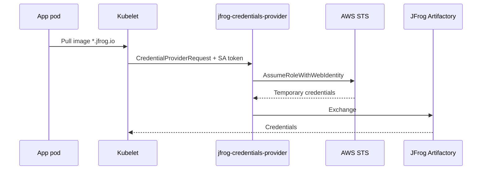
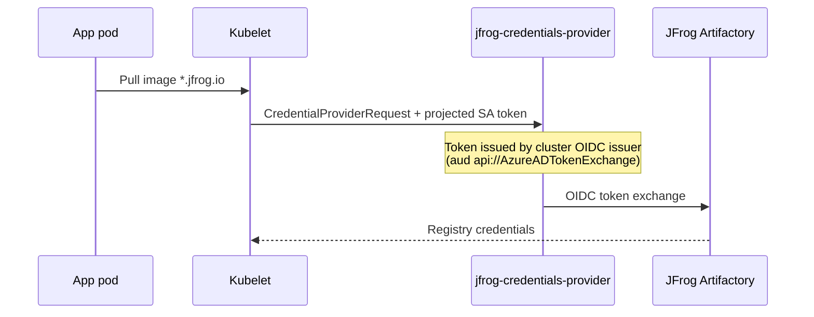

# OpenShift Setup Guide

This guide covers deploying the JFrog Kubelet Credential Provider on Red Hat OpenShift on **AWS** or **Azure** using projected service account tokens for per-workload identity.

Managed offerings such as ROSA (HCP and Classic) and ARO are supported deployment targets — the same `platform: openshift` flow applies to self-managed OpenShift on AWS and Azure.

> OpenShift on Google Cloud is not supported. OpenShift on Google Cloud may be added in a future release.

---

## Requirements (all clouds)

* OpenShift 4.21+: per-workload image pulls via kubelet `tokenAttributes` (projected ServiceAccount tokens) require **OpenShift 4.21 or newer**. 

* On OpenShift you must use projected service account tokens for Artifactory image pulls:
    - Set `providerConfig[].tokenAttributes.enabled: true` and `requireServiceAccount: true`.
    - Annotate **application** ServiceAccounts that pull images. You should **never** annotate the chart DaemonSet ServiceAccount.
    - The plugin reads the **pulling pod's** ServiceAccount from the `CredentialProviderRequest`.

* Short-lived credentials
    - Regardless of cloud, OpenShift clusters used with this guide must rely on short-lived credentials:

      | Cloud | CCO / identity model |
      |-------|----------------------|
      | **AWS** | AWS Security Token Service and IAM Roles as Service Accounts (IRSA) |
      | **Azure** | Microsoft Entra Workload Identity |

### Tested platforms

This provider has been tested on:

- Red Hat OpenShift Service on AWS (ROSA) with Hosted Control Planes
- Red Hat OpenShift Service on AWS (ROSA) Classic architecture
- Azure Red Hat OpenShift (ARO)

> Node-level and long-lived cloud credentials have not been tested on OpenShift with the JFrog Kubelet Credential Provider. 

---

### How it works (all clouds)

OpenShift (when deployed on AWS or Azure) automatically deploys kubelet credential providers on worker nodes:

| Component | Path on worker nodes |
|-----------|----------------------|
| Plugin binaries | `/usr/libexec/kubelet-image-credential-provider-plugins/` |
| Kubelet config | `/etc/kubernetes/credential-providers/<platform-plugin>.yaml` |

| Cloud | Platform plugin | Merged config file |
|-------|-----------------|-------------------|
| AWS | `ecr-credential-provider` | `ecr-credential-provider.yaml` |
| Azure | `acr-credential-provider` | `acr-credential-provider.yaml` |

With `platform: openshift` in Helm values, this chart:

1. Installs the JFrog plugin via a privileged DaemonSet
2. Stages binaries on writable `/var/lib/jfrog-credential-provider/bin/` to work properly with Red Hat Entperise Linux CoreOS (`/usr` is read-only)
3. Copies the existing platform credential plugin binary into staging
4. Bind-mounts staging over `/usr/libexec/kubelet-image-credential-provider-plugins/`
5. Merges the JFrog provider into the platform credential YAML
6. Sets `cloud_provider` during merge (as the pod network cannot reach cloud instance metadata services for security purposes)
7. Restarts kubelet on each worker (with health watcher + automated rollback)

---

## Install with Helm (all clouds)

### Namespace and Pod Security

Create the release namespace before install (or let your pipeline create it). **Do not** use Helm `--create-namespace` when `openshift.labelNamespacePodSecurity: true` (default): the chart manages a `Namespace` resource for Pod Security labels, and `--create-namespace` conflicts with that (Helm error: `original object Namespace ... not found`).

```bash
oc create namespace jfrog --dry-run=client -o yaml | oc apply -f -
oc label namespace jfrog app.kubernetes.io/managed-by=Helm --overwrite
oc annotate namespace jfrog meta.helm.sh/release-name=secret-provider meta.helm.sh/release-namespace=jfrog --overwrite
```

(The OpenShift test scripts in `scratch/` apply these labels automatically before `helm upgrade --install`.)

With `openshift.labelNamespacePodSecurity: true`, the chart applies `pod-security.kubernetes.io/enforce=privileged` and `security.openshift.io/scc.podSecurityLabelSync=false` on the release namespace. The chart does **not** set `audit` or `warn` labels — managing those via Helm conflicts with OpenShift's Pod Security label sync controller.

Set `openshift.labelNamespacePodSecurity: false` if your platform team manages namespace labels. Then label manually:

```bash
oc label namespace jfrog \
  pod-security.kubernetes.io/enforce=privileged \
  security.openshift.io/scc.podSecurityLabelSync=false \
  --overwrite
```

You may also set `audit` and `warn` to `privileged` manually if desired; the chart does not manage those labels to avoid Helm apply conflicts with OpenShift.

In addition, the injector DaemonSet requires the `privileged` Security Context Contstraint (SCC) because it relies on `hostPID` and `hostPath` volumes. As such, you must grant the **`privileged` SCC** to the injector DaemonSet's ServiceAccount (`openshift.grantPrivilegedSCC: true` or manual `oc adm policy`).


### Deploy the Helm chart

Before installing JFrog helm charts, you need to add the [JFrog helm repository](https://charts.jfrog.io/) to your helm client

```bash
helm repo add jfrog https://charts.jfrog.io
helm repo update
```

```bash
oc create namespace jfrog --dry-run=client -o yaml | oc apply -f -

helm upgrade --install secret-provider jfrog/jfrog-credential-provider \
  --namespace jfrog \
  -f ./examples/openshift-<cloud>-projected-sa-values.yaml
```

Replace `<cloud>` with `aws` or `azure`.

If you deployed the chart before you labeled the namespace or granted the `privileged` SCC, you may need to restart the DaemonSet to have it rollout:

```bash
oc rollout restart daemonset -n jfrog -l app.kubernetes.io/name=jfrog-credential-provider
```

### Confirm DaemonSet rollout

```bash
oc get daemonset -n jfrog
oc get pods -n jfrog -o wide
```

### Review injector DaemonSet logs

If `containerLogging: true` is set in your `values.yaml` file, logs are written to the DaemonSet pod's standard out.

```bash
POD=$(oc get pods -n jfrog -l app.kubernetes.io/name=jfrog-credential-provider -o jsonpath='{.items[0].metadata.name}')
oc logs -n jfrog "${POD}" -c jfrog-credential-provider-injector
```

Proceed to the cloud specific documentation below. 

| Cloud |
|-------|
| [AWS](#openshift-on-aws) |
| [Azure](#openshift-on-azure) |

See [debug.md](./debug.md) for node access and manual plugin testing.


---

## OpenShift on AWS

> Applies to ROSA HCP, ROSA Classic, and self-managed OpenShift on AWS.

Deploy with [examples/openshift-aws-projected-sa-values.yaml](./examples/openshift-aws-projected-sa-values.yaml). 

### Overview

Authentication uses IAM Roles for Service Accounts (IRSA): workload ServiceAccounts are annotated with `eks.amazonaws.com/role-arn` and `JFrogExchange: "true"`. The kubelet passes the pod's projected token to the plugin, which calls `AssumeRoleWithWebIdentity` and exchanges it with Artifactory.



### Prerequisites

You must first complete the [Install with Helm (all clouds)](#install-with-helm-all-clouds) procedure.

### Step 1: IAM — one role per workload ServiceAccount

```bash
export CLUSTER_NAME="<your-cluster>"
export OIDC_ISSUER=$(oc get authentication cluster -o jsonpath='{.spec.serviceAccountIssuer}')
export OIDC_HOSTPATH="${OIDC_ISSUER#https://}"
export AWS_ACCOUNT_ID=$(aws sts get-caller-identity --query Account --output text)
export APP_NAMESPACE="jfrog-pull-test"
export APP_SA_NAME="jfrog-pull-sa"
# Role name is jfrog-pull-${APP_NAMESPACE}-${APP_SA_NAME} (do not set ROLE_NAME separately)

cat > trust-policy.json <<EOF
{
  "Version": "2012-10-17",
  "Statement": [{
    "Effect": "Allow",
    "Principal": {
      "Federated": "arn:aws:iam::${AWS_ACCOUNT_ID}:oidc-provider/${OIDC_HOSTPATH}"
    },
    "Action": "sts:AssumeRoleWithWebIdentity",
    "Condition": {
      "StringEquals": {
        "${OIDC_HOSTPATH}:sub": "system:serviceaccount:${APP_NAMESPACE}:${APP_SA_NAME}",
        "${OIDC_HOSTPATH}:aud": "sts.amazonaws.com"
      }
    }
  }]
}
EOF

aws iam create-role --role-name "$ROLE_NAME" --assume-role-policy-document file://trust-policy.json
export ROLE_ARN=$(aws iam get-role --role-name "$ROLE_NAME" --query 'Role.Arn' --output text)

oc annotate serviceaccount "$APP_SA_NAME" -n "$APP_NAMESPACE" \
  eks.amazonaws.com/role-arn="$ROLE_ARN" \
  JFrogExchange=true --overwrite
```

> **Do not** annotate the Helm DaemonSet ServiceAccount with `eks.amazonaws.com/role-arn`.

See [Red Hat ROSA IRSA documentation](https://docs.redhat.com/en/documentation/red_hat_openshift_service_on_aws/4/html/authentication_and_authorization/assuming-an-aws-iam-role-for-a-service-account).

### Step 2: JFrog Artifactory — map each IAM role

OpenShift IRSA uses the **IAM role assumption** path: the plugin sends a signed AWS STS `GetCallerIdentity` request to Artifactory. Map **each** workload IAM role ARN to an Artifactory user (no OIDC provider is required in Artifactory for this flow).

Create an Artifactory admin access token under **Administration** → **Identity and Access** → **Access Tokens**, then:

```bash
export ARTIFACTORY_URL="<your-instance>.jfrog.io"
export ARTIFACTORY_ADMIN_TOKEN="<admin-access-token>"
export ARTIFACTORY_USER="<artifactory-user-for-this-workload>"
# ROLE_ARN from Step 1

# Remove an existing binding for this user, if any
curl -X DELETE "https://${ARTIFACTORY_URL}/access/api/v1/aws/iam_role/${ARTIFACTORY_USER}" \
  -H "Authorization: Bearer ${ARTIFACTORY_ADMIN_TOKEN}"

# Map the IAM role to the Artifactory user
curl -X PUT "https://${ARTIFACTORY_URL}/access/api/v1/aws/iam_role" \
  -H "Content-Type: application/json" \
  -H "Authorization: Bearer ${ARTIFACTORY_ADMIN_TOKEN}" \
  -d "{
    \"username\": \"${ARTIFACTORY_USER}\",
    \"iam_role\": \"${ROLE_ARN}\"
  }"

# Verify
curl -X GET "https://${ARTIFACTORY_URL}/access/api/v1/aws/iam_role/${ARTIFACTORY_USER}" \
  -H "Authorization: Bearer ${ARTIFACTORY_ADMIN_TOKEN}"
```

Repeat for every IAM role / ServiceAccount pair that pulls from Artifactory. The Artifactory user must already exist and have permission to pull from your repositories.

See the [JFrog Artifactory OIDC documentation](https://www.jfrog.com/confluence/display/JFROG/Access+Tokens#AccessTokens-OIDCIntegration) and [REST API: create OIDC configuration](https://jfrog.com/help/r/jfrog-rest-apis/create-oidc-configuration) for API reference.

### Helm values

| Value | Description |
|-------|-------------|
| `platform` | `openshift` |
| `providerConfig[].tokenAttributes.enabled` | `true` |
| `providerConfig[].tokenAttributes.requireServiceAccount` | `true` (recommended) |
| `providerConfig[].aws.aws_region` | AWS region |
| `openshift.grantPrivilegedSCC` | `true` |
| `openshift.labelNamespacePodSecurity` | `true` (default; set `false` to skip chart-managed PSA labels) |

### Verification

```bash
oc debug node/<worker> -- chroot /host bash -c '
  ls -la /usr/libexec/kubelet-image-credential-provider-plugins/jfrog-credentials-provider
  grep -A30 jfrog /etc/kubernetes/credential-providers/ecr-credential-provider.yaml
'
```

---

## OpenShift on Azure

> Applies to ARO and self-managed OpenShift on Azure.

Deploy with [examples/openshift-azure-projected-sa-values.yaml](./examples/openshift-azure-projected-sa-values.yaml). 

### Overview

Authentication uses **Microsoft Entra Workload Identity**: ServiceAccounts are annotated with `azure.workload.identity/client-id` and `JFrogExchange: "true"`.



Microsoft documents the flow in [Workload identity on ARO](https://learn.microsoft.com/en-us/azure/openshift/howto-deploy-configure-application).

### Prerequisites

You must first complete the [Install with Helm (all clouds)](#install-with-helm-all-clouds) procedure.

```bash
export ARO_OIDC_ISSUER="$(oc get authentication cluster -o jsonpath='{.spec.serviceAccountIssuer}')"
```

Verify pod-identity-webhook:

```bash
oc describe deployment pod-identity-webhook -n openshift-cloud-credential-operator \
  | grep 'target.workload.openshift.io/management'
```

### Step 1: User-assigned managed identity per workload

```bash
az identity create --name "${USER_ASSIGNED_IDENTITY_NAME}" --resource-group "${RESOURCE_GROUP}"
export USER_ASSIGNED_IDENTITY_CLIENT_ID="$(az identity show ... --query clientId -o tsv)"

az identity federated-credential create \
  --name "${FEDERATED_IDENTITY_CREDENTIAL_NAME}" \
  --identity-name "${USER_ASSIGNED_IDENTITY_NAME}" \
  --resource-group "${RESOURCE_GROUP}" \
  --issuer "${ARO_OIDC_ISSUER}" \
  --subject "system:serviceaccount:${SERVICE_ACCOUNT_NAMESPACE}:${SERVICE_ACCOUNT_NAME}" \
  --audience "api://AzureADTokenExchange"
```

### Step 2: Workload ServiceAccount

```yaml
annotations:
  azure.workload.identity/client-id: <managed-identity-client-id>
  JFrogExchange: "true"
```

**Do not** annotate the DaemonSet ServiceAccount with `azure.workload.identity/client-id`.

### Step 3: JFrog Artifactory OIDC

The plugin exchanges the pod's projected ServiceAccount token with Microsoft Entra ID, then with Artifactory. Artifactory must trust your **cluster OIDC issuer** (`$ARO_OIDC_ISSUER`), not the global Azure login URL.

```bash
export ARTIFACTORY_URL="<your-instance>.jfrog.io"
export ARTIFACTORY_ADMIN_TOKEN="<admin-access-token>"
export ARTIFACTORY_USER="<artifactory-user-for-this-workload>"
export OIDC_PROVIDER_NAME="<jfrog-oidc-provider-name>"   # same as providerConfig[].azure.jfrog_oidc_provider_name
export SERVICE_ACCOUNT_NAMESPACE="my-app"
export SERVICE_ACCOUNT_NAME="jfrog-pull-sa"
# ARO_OIDC_ISSUER from Prerequisites

# Create OIDC provider (cluster ServiceAccount issuer)
curl -X POST "https://${ARTIFACTORY_URL}/access/api/v1/oidc" \
  -H "Content-Type: application/json" \
  -H "Authorization: Bearer ${ARTIFACTORY_ADMIN_TOKEN}" \
  -d "{
    \"name\": \"${OIDC_PROVIDER_NAME}\",
    \"issuer_url\": \"${ARO_OIDC_ISSUER}\",
    \"provider_type\": \"Azure\",
    \"token_issuer\": \"${ARO_OIDC_ISSUER}\",
    \"use_default_proxy\": false,
    \"description\": \"OpenShift on Azure workload identity\"
  }"

# Identity mapping for this workload ServiceAccount
curl -X POST "https://${ARTIFACTORY_URL}/access/api/v1/oidc/${OIDC_PROVIDER_NAME}/identity_mappings" \
  -H "Content-Type: application/json" \
  -H "Authorization: Bearer ${ARTIFACTORY_ADMIN_TOKEN}" \
  -d "{
    \"name\": \"${OIDC_PROVIDER_NAME}-mapping\",
    \"description\": \"OpenShift workload identity mapping\",
    \"claims\": {
      \"aud\": \"api://AzureADTokenExchange\",
      \"iss\": \"${ARO_OIDC_ISSUER}\",
      \"sub\": \"system:serviceaccount:${SERVICE_ACCOUNT_NAMESPACE}:${SERVICE_ACCOUNT_NAME}\"
    },
    \"token_spec\": {
      \"username\": \"${ARTIFACTORY_USER}\",
      \"scope\": \"applied-permissions/user\",
      \"audience\": \"*@*\",
      \"expires_in\": 3600
    },
    \"priority\": 1
  }"

# Verify
curl -X GET "https://${ARTIFACTORY_URL}/access/api/v1/oidc/${OIDC_PROVIDER_NAME}" \
  -H "Authorization: Bearer ${ARTIFACTORY_ADMIN_TOKEN}" | jq
```

Configuration notes:

- `sub` must be exactly `system:serviceaccount:<namespace>:<service-account-name>` for the pulling workload.
- `aud` must be `api://AzureADTokenExchange` (matches federated credential and `azure_app_audience` in Helm values).
- `iss` must match `oc get authentication cluster -o jsonpath='{.spec.serviceAccountIssuer}'`.
- Set `expires_in` longer than `defaultCacheDuration` in Helm values (e.g. if cache is `5h`, use at least `18000` seconds).
- Set `azure_app_client_id` in Helm to the same Artifactory `token_spec.audience` as the identity mapping (typically `*@*`). Despite the name, this is **not** an Entra application client ID for OpenShift projected tokens.
- Use the same `jfrog_oidc_provider_name` in Helm as in Artifactory above.

### Helm values

| Setting | Value |
|---------|-------|
| `platform` | `openshift` |
| `providerConfig[].azure.enabled` | `true` |
| `providerConfig[].tokenAttributes.enabled` | `true` |
| `providerConfig[].azure.azure_app_client_id` | Artifactory OIDC exchange audience (e.g. `*@*`); must match identity mapping `token_spec.audience` |
| `providerConfig[].azure.jfrog_oidc_provider_name` | Same as `OIDC_PROVIDER_NAME` above |
| `providerConfig[].azure.azure_app_audience` | `api://AzureADTokenExchange` |
| `openshift.grantPrivilegedSCC` | `true` |
| `openshift.labelNamespacePodSecurity` | `true` (default; set `false` to skip chart-managed PSA labels) |

### Verification

```bash
oc debug node/<worker> -- chroot /host bash -c '
  ls -la /usr/libexec/kubelet-image-credential-provider-plugins/jfrog-credentials-provider
  grep -A30 jfrog cat /etc/kubernetes/credential-providers/acr-credential-provider.yaml
'
```

---

## Platform reference

When `platform: openshift` is set:

| Cloud | Staging dir | Platform plugin | Kubelet config | Merge env |
|-------|-------------|-----------------|----------------|-----------|
| AWS | `/var/lib/jfrog-credential-provider/bin` | `ecr-credential-provider` | `ecr-credential-provider.yaml` | `cloud_provider=aws` |
| Azure | same | `acr-credential-provider` | `acr-credential-provider.yaml` | `cloud_provider=azure` |

The bind mount is re-applied when the DaemonSet init container runs (including after node reboot).

---

## Troubleshooting

### All clouds

| Symptom | Things to check |
|---------|-----------------|
| Kubelet fails: `tokenAttributes is not supported...` | Upgrade to **OpenShift 4.21+** |
| Kubelet fails: missing/invalid `cacheType` | **4.21+** required when `tokenAttributes` is set |
| `curl: Read-only file system` under `/usr/libexec/...` | Use `./helm` with `platform: openshift` (bind-mount staging) |
| `cp: ... are the same file` for platform plugin | Restart DaemonSet after chart upgrade (`umount` before copy) |
| Init log shows EKS/AKS/GKE paths | Missing `platform: openshift` or wrong chart source |
| DaemonSet blocked | Privileged Pod Security + SCC (see [Install with Helm](#install-with-helm-all-clouds)) |
| `Updating the kubelet configuration failed` | Host `/var/log/jfrog-credentials-provider/jfrog-credentials-provider.log`; upgrade chart |

### AWS

| Symptom | Things to check |
|---------|-----------------|
| `InvalidIdentityToken` from STS | IAM trust `:sub` / `:aud` vs token claims; kubelet `tokenAttributes.serviceAccountTokenAudience` must be `sts.amazonaws.com` |
| `AccessDenied` on `AssumeRoleWithWebIdentity` | IAM OIDC provider missing for cluster issuer; trust policy `:sub`/`Principal.Federated` stale (re-run `update-assume-role-policy`); wrong `eks.amazonaws.com/role-arn` on workload SA |
| Plugin uses node role | Workload SA missing `JFrogExchange` or `role-arn` |
| Pull works on ECR but not Artifactory | `matchImages`; merged `ecr-credential-provider.yaml` |

### Azure

| Symptom | Things to check |
|---------|-----------------|
| Init log shows `/var/lib/kubelet/credential-provider` | AKS paths — set `platform: openshift` |
| Plugin uses node identity | Missing `azure.workload.identity/client-id` or `JFrogExchange` |
| Artifactory 401 | OIDC `iss` / `sub` / `aud` vs cluster issuer and SA |

See [debug.md](./debug.md) for general debugging.

---

## Additional resources

- [AWS.md](./AWS.md) — EKS deployment (other AWS auth options)
- [AZURE.md](./AZURE.md) — AKS deployment (node pool identity and AKS workload identity)
- [GCP.md](./GCP.md) — GKE deployment (node-level and GKE workload identity)
- [JFrog Artifactory OIDC documentation](https://www.jfrog.com/confluence/display/JFROG/Access+Tokens#AccessTokens-OIDCIntegration)
- [README.md](./README.md) — Project overview
- [Kubernetes kubelet credential provider](https://kubernetes.io/docs/tasks/administer-cluster/kubelet-credential-provider/)
