# 🐸 JFrog Kubelet Credential Provider

A [Kubernetes kubelet credential provider](https://kubernetes.io/docs/tasks/administer-cluster/kubelet-credential-provider/) **for Amazon EKS, Azure AKS and Google GKE** that enables seamless, passwordless authentication with JFrog Artifactory for container image pulls, eliminating the need for manual image pull secret management.

> ⚠️ **Beta Release Notice**
> 
> This project is currently in its **beta phase**, meaning it's still under active development. We strongly recommend thorough testing in non-production environments before deployment to any production system.

## 📋 Overview

The JFrog Kubelet Credential Provider leverages the native Kubernetes kubelet Credential Provider feature (the same standard used by Amazon ECR, Google Cloud, and Microsoft Azure for their native registry authentication) to dynamically retrieve credentials for pulling container images from JFrog Artifactory. Instead of using long-lived, static passwords or API keys, this solution uses temporary, identity-based credentials that are dynamically generated on-demand.

This approach provides several benefits:

| Benefit | Description |
|---------|-------------|
| 🔐 **No Image Pull Secrets** | Eliminates the need to create and manage Kubernetes secrets across namespaces |
| 🛡️ **Enhanced Security** | Credentials are retrieved dynamically rather than stored in etcd, minimizing attack surface |
| 🔑 **Passwordless Authentication** | Uses cloud provider identity (IAM roles, managed identities, service accounts) instead of static credentials |
| ⚡ **Simplified Operations** | Reduces operational overhead for credential rotation and management |
| 🔗 **Native Integration** | Uses built-in Kubernetes capabilities for credential management |
| ⏱️ **Short-Lived Tokens** | Artifactory returns newly generated, short-lived tokens for registry authentication |

## 🎯 Strategic Benefits

### 🛡️ Enhanced Security Posture (Identity over Secrets)

The security posture of Kubernetes deployments is dramatically enhanced by moving away from long-lived passwords and static API keys. The replacement of these persistent credentials with short-lived and dynamically generated tokens minimizes the attack surface and the potential blast radius in the event of a cluster compromise. The solution enforces the principle of least privilege by linking image pull access directly to the validated infrastructure identity of the worker node (its IAM role, managed identity, or service account). By embedding the cryptographic proof of identity within the artifact pull process, the risk of external or internal credential theft is effectively neutralized.

### ⚡ Operational Efficiency and Speed of Deployment

Operators are liberated from the continuous, tedious, and often error-prone tasks associated with managing Kubernetes secrets, rotation schedules, and ensuring correct namespace-specific configurations. This elimination of secret management reduces operational friction, ensuring greater stability and allowing for significantly faster workload deployments. This efficiency is especially critical for large organizations who need to rapidly deploy new workloads without inheriting the complexity and security issues that were previously unavoidable.

### ✨ Optimized User Experience

By streamlining the use of JFrog Artifactory with Kubernetes, the integration offers an overall optimized user experience and delivers greater stability throughout the deployment pipeline. Developers and DevOps teams can focus on application delivery rather than infrastructure credential plumbing, trusting that the underlying infrastructure identity mechanisms will securely and automatically handle artifact authentication.

## ⚠️ The Problem with Traditional Credential Management

The current deployment model for applications hosted in private registries relies on including `imagePullSecrets` within deployment configurations. These secrets typically hold long-lived authentication artifacts, like passwords, API keys, or access tokens, required to authenticate against the private registry. While functional, this traditional method introduces significant security vulnerabilities and operational overhead:

<details>
<summary><strong>🚨 Security Risks</strong></summary>

- **Static Secrets in etcd**: Passwords sit as static secrets in your Kubernetes etcd database, creating an unnecessary attack surface
- **Long-Lived Credentials**: Persistent credentials increase the potential blast radius in the event of a cluster compromise
- **Credential Exposure**: Secrets are visible to users with namespace access and can be exposed through logs or config dumps

</details>

<details>
<summary><strong>😫 Operational Headaches</strong></summary>

- **Multi-Namespace Management**: You often need one secret per namespace across a large cluster
- **Manual Rotation**: If an access token is revoked or expires, you must manually update secrets across all relevant namespaces
- **Complex CI/CD Logic**: Requires substantial resources and complex automation just for secret rotation
- **Deployment Friction**: Every new workload must be configured with the correct `imagePullSecrets` reference

</details>

## 🔄 How It Works: Identity Over Passwords

The JFrog Kubelet Credential Provider implements a **passwordless credential flow** that uses your cloud provider's identity system instead of static secrets. This solution is based on the established, built-in Kubernetes feature called the **Kubelet Image Credential Provider** - the same standard used by Amazon ECR, Google Cloud, and Microsoft Azure for their native registry authentication.

**🔐 The Passwordless Credential Flow:**

```mermaid
flowchart TD
    Start[📦 Pod Requests Image from Artifactory] --> Check{🎯 Kubelet Matches Image Pattern?}
    Check -->|Yes| Execute[⚙️ Execute Plugin jfrog-credential-provider]
    Check -->|No| Default[Use Default Authentication]
    
    Execute --> Identity{🔐 Get Cloud Identity}
    Identity -->|AWS| AWS[🆔 AWS IAM Role or Cognito OIDC]
    Identity -->|Azure| Azure[🔷 Azure Managed Identity]
    Identity -->|GCP| GCP[🔵 GCP Service Account]
    
    AWS --> Exchange[🔄 Exchange Identity with Artifactory via OIDC/IAM Role]
    Azure --> Exchange
    GCP --> Exchange
    
    Exchange --> Token[🎫 Artifactory Returns Short-Lived Token]
    Token --> Pull[✅ Kubelet Uses Token to Pull Image]
    Pull --> Success[🚀 Pod Starts Successfully]
    
    style Start fill:#f0f9ff,stroke:#0284c7,stroke-width:2px
    style Execute fill:#fef3c7,stroke:#f59e0b,stroke-width:2px
    style Exchange fill:#dcfce7,stroke:#16a34a,stroke-width:2px
    style Token fill:#f3e8ff,stroke:#9333ea,stroke-width:2px
    style Success fill:#dcfce7,stroke:#16a34a,stroke-width:2px
    style AWS fill:#fff7ed,stroke:#ea580c,stroke-width:2px
    style Azure fill:#eff6ff,stroke:#2563eb,stroke-width:2px
    style GCP fill:#f0fdf4,stroke:#22c55e,stroke-width:2px
```



**Step-by-Step Process:**

1. **📦 Image Pull Request**: A new pod needs an image from Artifactory
2. **🎯 Kubelet Interception**: The Kubelet on your worker node matches the image host with the pattern configured for the JFrog provider
3. **⚙️ Plugin Execution**: The Kubelet executes the configured plugin binary: `jfrog-credential-provider`
4. **🔄 Token Exchange**: The provider uses the worker node's verified cloud identity (AWS IAM Role/OIDC or Azure managed identity) and exchanges that proof of identity with Artifactory via OIDC
5. **🎫 Short-Lived Token**: Artifactory returns a newly generated, short-lived token intended for registry authentication
6. **✅ Image Pull**: The Kubelet uses the temporary token to securely pull the image and complete the deployment

> **💡 Key Point**: No Kubernetes secret creation or management is required. Credentials are dynamically generated on the node and cached inside the kubelet process memory, never stored in etcd.

## 📊 Benefits: Traditional vs. Credential Provider

| **Feature** | **Traditional imagePullSecrets** | **JFrog Kubelet Credential Provider** |
|------------|----------------------------------|--------------------------------------|
| **Credential Type** | Long-lived passwords/API Keys/Tokens | Short-lived, ephemeral Artifactory Tokens |
| **Storage Location** | Kubernetes etcd, CI/CD secrets vault | None (Dynamically generated on the node and cached in kubelet process memory) |
| **Security Risk Profile** | High (static exposure risk, complexity of rotation) | Low (Dynamic, Identity-based) |
| **Operational Effort** | High (Manual rotation, multi-namespace management) | Negligible (Automated via Kubelet/Node Identity) |
| **Foundation** | Kubernetes Secrets API | Kubernetes Kubelet Credential Provider Standard |
| **Workload Configuration** | Requires `imagePullSecrets` in every deployment | Zero configuration needed |

For detailed setup instructions, see the cloud provider-specific guides below.

## 📦 Deployment Options

The recommended deployment method is using **Helm charts**, which simplifies installation and configuration across your cluster.

### 🚀 Quick Start

Choose your cloud provider to get started:

<div align="center">

| Cloud Provider | Setup Guide | Status |
|:--------------:|:-----------:|:------:|
| ☁️ **AWS EKS** | [AWS Setup Guide](./AWS.md) | ✅ Supported |
| 🔷 **Azure AKS** | [Azure Setup Guide](./AZURE.md) | ✅ Supported |
| 🔵 **GCP GKE** | [GCP Setup Guide](./GCP.md) | ✅ Supported |

</div>


## 📋 Logging and Debugging

### 📄 View Plugin Logs

Plugin logs are available in your kubelet VM at:

```bash
tail -f /var/log/jfrog-credential-provider.log
```

### 🐛 Debugging Guide

For detailed debugging instructions, troubleshooting steps, and common issues, see the [🐛 Debug Documentation](./debug.md) file.

## 📚 Additional Resources

### 📖 Official Documentation

- [📘 Kubernetes Kubelet Credential Provider Documentation](https://kubernetes.io/docs/tasks/administer-cluster/kubelet-credential-provider/)
- [🐸 JFrog Artifactory OIDC Documentation](https://www.jfrog.com/confluence/display/JFROG/Access+Tokens#AccessTokens-OIDCIntegration)

### 🔗 Related Links

- [☁️ AWS Setup Guide](./AWS.md) - Complete AWS EKS setup instructions
- [🔷 Azure Setup Guide](./AZURE.md) - Complete Azure AKS setup instructions
- [🔵 GCP Setup Guide](./GCP.md) - Complete GCP GKE setup instructions
- [🐛 Debug Documentation](./debug.md) - Troubleshooting and debugging guide

